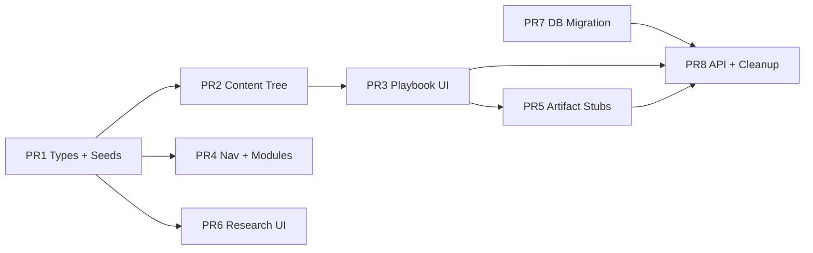

# Sprint 02 — Execution Plan

**Spec:** [`PLAYBOOK_SCHEMA_V1.md`](./PLAYBOOK_SCHEMA_V1.md)  
**Gap analysis:** [`PLAYBOOK_SCHEMA_V1_GAP_ANALYSIS.md`](./PLAYBOOK_SCHEMA_V1_GAP_ANALYSIS.md)

**Strategy:** Small, reviewable PRs. Each PR leaves `main` deployable. JSON + types first; DB migration before wiring Supabase reads; delete `playbookScaffold.js` only when Day 1 loads from `/content`.

---

## PR sequence (recommended)

### PR 1 — Types + seed manifests (Phases 1–2, 5, 10–12 types only)

**Goal:** Single source of truth for all domain interfaces.

- Add `src/types/playbook.ts` (all interfaces from spec, including `Session` stub for future use).
- Add `src/data/seeds/` JSON or `.js` re-exports:
  - `competencies.json`
  - `milestones.json`
  - `weekIntegrations.json`
  - `businessPlanChapters.json`
  - `portfolioSections.json`
  - `careerTracks.json` + `trackRequirements.json`
  - `ventureBoards.json` + `ventureBoardCriteria.json`
- Add `src/lib/playbookSeeds.js` — loaders with stable IDs.
- **No UI changes.**

**Exit:** `npm run build` passes; types importable from playbook shell later.

---

### PR 2 — Content tree + Segment 1 scaffold (Phase 6, partial 15)

**Goal:** File-based curriculum import path.

```text
content/segment-1/
  segment.json
  week-1/
    week.json
    day-1/
      day.json
      presentation.json
      activities.json
      worksheets.json
      assessment.json
      survey.json
      contributions.json   # DayContribution for Phase 10
```

- Add `src/lib/contentLoader.js` — `import.meta.glob` or fetch from `public/content`.
- Seed **realistic mock copy** for Day 1 (not full curriculum).
- **Do not** delete `playbookScaffold.js` yet.

**Exit:** Unit smoke: loader returns typed Day 1 bundle.

---

### PR 3 — Playbook tree + Day view shell (Phases 7–10 UI, partial 14–15)

**Goal:** Acceptance path UI without Supabase curriculum reads.

- Refactor `PlaybookShell.jsx`:
  - Segment → Week → Day navigation from content loader.
  - **DayView** panel: objectives, deliverables, contribution chips (portfolio / business plan / competencies).
- Add `src/components/playbook/`:
  - `PresentationViewer`, `SlideViewer`, `SpeakerNotesPanel`, `DiscussionPanel`, `SlideNavigator`
  - `ActivityViewer`
  - `WorksheetViewer` (field types: short/long text, rating, checkbox, file upload stub)
  - `AssessmentPanel` (display-only rubric placeholder)
- Wire Day 1 mock through all viewers.

**Exit:** Manual test — Playbook → Segment 1 → Week 1 → Day 1 shows all acceptance fields.

---

### PR 4 — Module shells: Business Plan, Milestones, Venture Board (Phases 3–5, 12, 14)

**Goal:** Navigation matches spec; read-only seed data.

- `src/routes/paths.js`: add `businessPlan`, `milestones`, `ventureBoard`.
- `MODULE_NAV`: insert new entries; decide mobile order (suggest: Dashboard | Playbook | Portfolio | More… or scroll row).
- New pages:
  - `BusinessPlanPage.jsx` — chapter list + empty artifact placeholder per participant.
  - `MilestonesPage.jsx` — hour gates + week integration summary.
  - `VentureBoardPage.jsx` — Hour 200 board + criteria weights (read-only).
- `CareerTrackPage` optional sub-section under Milestones or Portfolio (defer if nav too crowded).
- Update `canAccessRoute` / `RoleRouteGuard` tests if any.

**Exit:** All six curriculum modules reachable; staff retains Reports/Admin.

---

### PR 5 — Portfolio + Business Plan artifact stubs (Phases 3–4 behavior)

**Goal:** Prove cross-system contribution without final scoring.

- Local state or Supabase-ready service layer:
  - `createPortfolioArtifactDraft({ sectionId, sourceType, sourceId })`
  - `createBusinessPlanArtifactDraft({ chapterId, ... })`
- Worksheet submit → optional “Add to portfolio” (draft status).
- `PortfolioPage` — sections from seeds + draft list UI.
- `BusinessPlanPage` — chapters + per-chapter artifact list UI.

**Exit:** Day 1 worksheet completion can create draft artifact (mock participant id).

---

### PR 6 — Research foundation UI (Phase 11)

**Goal:** Types + read-only shells only.

- Types already in PR 1; add `ResearchSquadPage` sections on `ResearchPage`:
  - Survey definition display (from `survey.json`)
  - `ResearchProject` / `ResearchSquad` placeholders
- **No** live survey collection.

---

### PR 7 — Database migration (Phase 13)

**Goal:** Supabase schema matches spec; migrate from Sprint 01 where possible.

- New file: `supabase/migrations/20260620_sprint_02_instructional_architecture.sql`
- Actions:
  - Add missing tables (see spec Phase 13).
  - Add `sessions` table if Session is first-class.
  - Align `venture_portfolio_entries` → `portfolio_artifacts` (migration path or view).
  - Seed reference rows: competencies, milestones, chapters, sections, career tracks, venture board.
  - RLS policies consistent with Sprint 01 patterns.
- Document apply steps in `supabase/README.md`.

**Exit:** Migration applies cleanly on fresh + upgrade from Sprint 01.

---

### PR 8 — Wire API + retire hardcoded scaffold (Phases 6, 13, 15)

**Goal:** Production data path.

- `apiClient.js` / Supabase reads for curriculum tree (fallback to JSON if row missing).
- Delete `src/data/playbookScaffold.js`.
- Archive or remove unused `fullSyllabusData.js` references from portal monolith.
- Re-run acceptance checklist on deployed `npm run deploy:prod`.

**Exit:** Gap analysis acceptance criteria all ✅.

---

## Dependency graph



---

## Per-PR verification

| Check | PRs |
|-------|-----|
| `npm run build` | All |
| `npm run lint` | All |
| Playbook Day 1 manual | 3, 8 |
| Mobile nav usable | 4+ |
| Supabase migration dry-run | 7 |
| Deploy smoke `deploy:prod` | 8 |

---

## Files likely touched (by area)

| Area | Paths |
|------|-------|
| Types | `src/types/playbook.ts` |
| Content | `content/**`, `src/lib/contentLoader.js` |
| Playbook UI | `src/pages/PlaybookShell.jsx`, `src/components/playbook/**` |
| Modules | `src/pages/BusinessPlanPage.jsx`, `MilestonesPage.jsx`, `VentureBoardPage.jsx` |
| Nav | `src/routes/paths.js`, `src/components/nav/ModuleNav.jsx`, `SpikeMasterPortal.jsx` routes |
| Data | `src/lib/playbookSeeds.js`, `src/apiClient.js` |
| DB | `supabase/migrations/20260620_sprint_02_instructional_architecture.sql` |
| Remove | `src/data/playbookScaffold.js` (PR 8) |

---

## Out of scope reminders (do not slip in)

- Full Segment 1–5 day content
- Venture board scoring workflow
- Research survey collection / analytics
- Career track enrollment logic
- PDF / export

---

## Docs commit (this session)

Commit together:

- `PLAYBOOK_SCHEMA_V1.md` (full Sprint 02 spec)
- `PLAYBOOK_SCHEMA_V1_GAP_ANALYSIS.md`
- `PLAYBOOK_SCHEMA_V1_EXECUTION_PLAN.md`
- `README.md` link updates (if not already)

**Do not** commit application code until PR 1 begins unless user requests otherwise.

**END**
