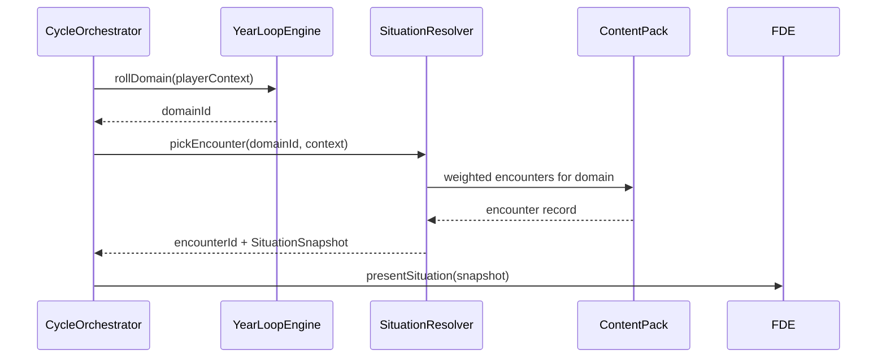
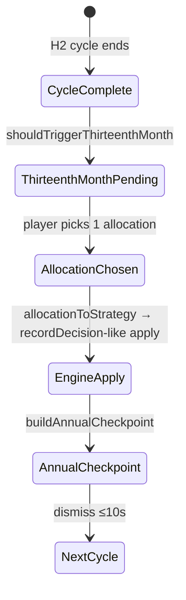

# SPIKE LIFE™ — GDS v1.0 Realignment Technical Design

**Status:** Implemented (2026-06-29)  
**Authority:** [GDS v1.0](../gdd/GDS_v1.0/SPIKE_LIFE_GDS_v1.0.pdf) · [Gap Analysis](../gdd/GDS_v1_GAP_ANALYSIS.md)  
**Delivery plan:** [Realignment Phases](../gdd/GDS_v1_REALIGNMENT_PHASES.md)

This document specifies **what to build** and **how components connect** before any realignment coding begins. It does not replace the GDS; it translates GDS Vol I–VI MVP requirements into concrete domain, content, UI, and infrastructure contracts.

---

## 1. Design goals

| Goal | GDS source | Success measure |
|------|------------|-----------------|
| One planning cycle semantics everywhere | Ch 2 §10, Ch 3 §4 | Solo and workshop run identical domain → situation → decision → consequence sequence |
| Time model honesty | Ch 2 §9 | Campaign = 20 cycles; workshop = 5 macro chapters with documented 4:1 compression |
| Content-driven situations | Ch 4 §21, Ch 5, A4 | Zero encounter definitions in `@spike-life/domain` |
| Simultaneous multiplayer | Ch 12 | All players lock decisions before engine runs; production sync in R7 |
| Hidden engine, visible story | Ch 1 §4, Ch 7 | Players never see formulas; encounter cards show narrative + 3 choices |
| Life Score wins | Ch 13 | End ceremony ranks by overall score, not net worth |

### Non-goals (MVP)

- AI-generated scenarios (GDS Ch 1 §13)
- FWAT / campaign editor (Ch 24)
- Difficulty engine presets beyond timer (Ch 14 — defer)
- Domain audio cues (Ch 4 §16 — optional post-R8)
- Online matchmaking / public lobbies

---

## 2. Current vs target architecture

### 2.1 Today (simplified)

```mermaid
flowchart TB
  subgraph ui [apps/web]
    Solo[LifeWorkspace]
  end
  subgraph workshop_ui [apps/web workshop]
    WS[WorkshopWorkspace]
    ST[StageTrack board]
  end
  subgraph app [@spike-life/application]
    FDE[FinancialDecisionCommandBus]
    GRB[GameRoomCommandBus]
  end
  subgraph domain [@spike-life/domain]
    Sim[Simulation aggregate]
    GR[GameRoom aggregate]
    SE[situation-engine — 2 hardcoded scenarios]
    ED[encounter-deck.ts — hardcoded]
  end
  subgraph content [@spike-life/content-philippines]
    YL[year-loop.json]
    CJ[campaign.json]
    AR[archetypes.json]
  end
  Solo --> FDE --> Sim
  WS --> GRB --> GR
  GRB --> Sim
  Sim --> SE
  ED -.->|solo year reveal only| Solo
  YL --> domain
  ST -.->|diverges from GDS board| WS
```

**Pain points:** Workshop bypasses year-loop board; `startRoomTurn(scenarioId)` forces facilitator to pick `promotion` or `protection_stress`; calendar events wired solo-only; repos in-memory.

### 2.2 Target (post-realignment)

```mermaid
flowchart TB
  subgraph ui [apps/web — unified shell]
    PCS[PlanningCycleShell]
    DGB[DomainGridBoard + YearRevealSequence]
    Lenses[Five Lenses]
    CalMod[CalendarModals]
    EndScr[LifeSummaryScreen]
  end
  subgraph app [@spike-life/application]
    CBS[CycleCommandBus]
    QBS[CycleQueryBus]
    GRB[GameRoomCommandBus]
  end
  subgraph domain [@spike-life/domain]
    Sim[Simulation + CycleOrchestrator]
    YLE[YearLoopEngine]
    SitRes[SituationResolver — pack port]
    Cal[CalendarEventHandler]
  end
  subgraph content [@spike-life/content-philippines]
    ENC[encounters.json]
    YL[year-loop.json]
    CJ[campaign.json]
  end
  subgraph infra [R7 — Cloudflare]
    API[Hono Worker API]
    RT[WebSocket room channel]
    DB[(Neon / D1)]
  end
  PCS --> DGB --> Lenses
  PCS --> CalMod --> EndScr
  ui --> CBS --> Sim
  ui --> GRB
  Sim --> YLE --> SitRes
  SitRes --> ENC
  YLE --> YL
  GRB --> API --> DB
  API --> RT
```

---

## 3. Session modes

### 3.1 Two playable profiles

Both profiles share the **same Planning Cycle FSM** (§4). They differ only in **how many cycles execute** and **lobby configuration**.

| Field | `campaign` | `workshop_compressed` |
|-------|------------|----------------------|
| `sessionMode` | `'campaign'` | `'workshop_compressed'` |
| Planning cycles played | 20 (`maxCycles`) | 20 logical cycles compressed into 5 macro turns |
| `turnNumber` range | 1–20 (1:1 with `cycleIndex`) | 1–5 |
| `cycleIndex` advance | +1 per completed cycle | +4 per macro turn (20 ÷ 5) |
| Target duration | ~60–90 min (full GDS) | 45–60 min (classroom) |
| Dream board | Interactive (solo) / auto-default (workshop) | Auto-default on join |
| Facilitator | N/A (solo) | Required; selects mode in lobby; default **campaign** |
| End condition | `cycleIndex >= maxCycles` | `turnNumber >= maxTurns` (compressed) or `cycleIndex >= 20` (campaign) |

### 3.2 New state fields (SimulationState)

```typescript
// Proposed additions to simulation-session.ts
sessionMode: 'campaign' | 'workshop_compressed'
selectedDomainId: string | null      // from year-loop this cycle
encounterId: string | null           // content pack encounter
eventClass: 'positive' | 'negative' | 'opportunity' | 'crisis' | 'milestone' | null
domainHistory: string[]              // last N domains for cooldown
advisorPausedUntil: string | null    // ISO — timer pause (GDS Ch 3 §14)
```

`scenarioId` becomes **derived** from encounter metadata (`encounter.scenarioTemplate: 'income_opportunity' | 'protection_stress' | 'generic'`) for FDE routing during migration, then deprecated.

### 3.3 Campaign config extension

Extend `CampaignConfig` in `content-core` (no breaking change to existing JSON):

```typescript
interface CampaignConfig {
  // existing fields...
  workshopCompression?: {
    macroTurns: number           // default 5
    cyclesPerMacroTurn: number   // default 4 (derived: totalCycles / macroTurns)
  }
  sessionDefaults?: {
    startingAge: number          // default 22
    decisionTimerSeconds: DecisionTimerPreset
  }
}
```

`campaign.json` already has `workshopMacroTurns: 5`; formalize the compression ratio in validation (`totalYears * cyclesPerYear === workshopMacroTurns * cyclesPerMacroTurn`).

---

## 4. Planning Cycle finite state machine

### 4.1 GDS-canonical cycle phases

GDS Ch 3 §4 mandates a fixed sequence. Map to domain `CyclePhase` enum (expand current 7 phases):

| Order | GDS step | Proposed `CyclePhase` | Player interaction |
|-------|----------|----------------------|-------------------|
| 0 | Initialize cycle | `cycle_initializing` | None (engine only) |
| 1 | Generate life domain | `domain_selecting` | Watch 2–3s animation |
| 2 | Generate situation | `situation_generating` | None (engine only) |
| 3 | Reveal situation | `situation_presented` | Read encounter card |
| 4 | Discovery (FNA prep) | `discovery_complete` | Optional advisor insight |
| 5 | Decision timer | `decision_pending` | Pick 1 of 3 strategies |
| 6 | Engine processing | `consequences_processing` | Brief processing indicator |
| 7 | Consequence reveal | `consequences_applied` | See deltas |
| 8 | Reflection | `reflection_complete` | 1–2 reflection taps |
| 9 | Cycle complete | `cycle_complete` | Ready for next |
| — | Calendar gate | `calendar_pending` | 13th month OR annual review (blocks advance) |

**Migration strategy:** Map existing phases 1:1 where possible; insert new phases behind feature flag `STRICT_GDS_FSM=false` initially, then flip when UI catches up.

```text
created → domain_selecting → situation_presented → discovery_complete
  → decision_pending → consequences_processing → consequences_applied
  → reflection_complete → cycle_complete
```

Calendar sub-state overlays `cycle_complete` when `pendingCalendarEvent !== null`:

```text
cycle_complete + pendingCalendarEvent='thirteenth_month'
  → (player chooses allocation) → calendar_pending resolved
  → optional annual_checkpoint modal
  → advance cycle/turn
```

### 4.2 Room-level synchronization (workshop)

Expand `RoomPhase`:

```typescript
type RoomPhase =
  | 'lobby'
  | 'cycle_active'           // replaces turn_active
  | 'awaiting_calendar'      // any player has pending calendar event
  | 'processing'             // all decided; engine running
  | 'debrief'                  // 5–10s discussion window (GDS Ch 3 §21)
  | 'session_complete'
```

**Barrier rules (GDS Ch 3 §5, §17):**

1. Room cannot enter `processing` until every active slot is `decided` OR `auto_advisor` resolved.
2. Facilitator cannot `advanceRoomTurn` while any slot has `pendingCalendarEvent`.
3. Timer `cycleDeadlineAt` is set once per room cycle start (shared ISO timestamp).

### 4.3 Cycle orchestrator (new domain service)

Extract from `Simulation` + `game-room-orchestrator`:

```text
packages/domain/src/services/cycle-orchestrator.ts
```

Responsibilities:

- `initializeCycle(sim, yearLoopContext)` → domain + encounter IDs
- `lockDecision(sim, strategy, source)` → immutable
- `processAllPlayers(simStates[])` → batch consequence (workshop)
- `resolveCalendarEvent(sim, allocationId)` → calls `allocationToStrategy`
- `canAdvanceCycle(sim)` → checks phase + calendar gates

`Simulation` remains aggregate root; orchestrator is a **domain service** with no state.

---

## 5. Year-loop → situation pipeline

### 5.1 Replace `startPlanningCycle(scenarioId)`

**Current:** Facilitator picks `promotion` | `protection_stress` → hardcoded situation.

**Target:** Domain-driven selection every cycle.



### 5.2 Player context for weighting

`YearLoopContext` (extend existing):

```typescript
interface YearLoopContext {
  age: number
  careerType: CareerType
  archetypeId: string
  maritalStatus: 'single' | 'married' | 'widowed'  // from character
  hasChildren: boolean
  activeGoalIds: string[]
  domainHistory: string[]        // cooldown input
  halfYear: 'H1' | 'H2'          // seasonal boost H2
  financialHealthBand: 'excellent' | 'good' | 'stable' | 'vulnerable' | 'critical'
}
```

Weight pipeline (GDS Ch 4 §6–11):

1. Base weights from `year-loop.json` age band
2. Multiply by goal proximity weights (approaching target age for home → boost `housing`)
3. Apply domain cooldown (recent domains × 0.3)
4. Apply H2 seasonal tag boost from pack (`seasonal: ['christmas', 'typhoon']`)
5. Normalized random selection

### 5.3 Event class balance governor (R4)

Track rolling 5-cycle window per player:

| Class | Target share |
|-------|--------------|
| positive | 35% |
| negative | 30% |
| neutral | 20% |
| opportunity | 15% |

If negative streak > 2, next pick forces positive or opportunity from pool. Implemented in `SituationResolver`, not UI.

### 5.4 SituationResolver port

```typescript
// packages/domain/src/ports/encounter-repository.ts
interface EncounterRepository {
  getByDomain(domainId: string): EncounterRecord[]
  getById(encounterId: string): EncounterRecord | null
}
```

Application bootstrap injects pack adapter; domain never imports `@spike-life/content-philippines`.

---

## 6. Content pack schema (encounters)

### 6.1 File layout

```text
content-philippines/src/data/
  encounters/
    index.json              # manifest: version, domain index
    career.json
    family.json
    ...
  life-situations.json      # narrative ID cross-ref (existing)
  year-loop.json
  campaign.json
```

### 6.2 Encounter record schema

```typescript
interface EncounterRecord {
  id: string                          // e.g. "career_promotion_01"
  domainId: string                    // must match year-loop domain
  eventClass: 'positive' | 'negative' | 'opportunity' | 'crisis' | 'milestone'
  intensity: 1 | 2 | 3 | 4            // GDS Ch 4 §12
  title: string
  teaser: string                      // short card text
  narrative: string                   // full reveal copy
  learningObjective: string
  scenarioTemplate: 'income_opportunity' | 'protection_stress' | 'generic'
  /** Weight modifiers — no financial math */
  weights: {
    base: number
    bands?: { launch?: number; mid?: number; late?: number }
    goals?: Record<string, number>    // goalId → multiplier
    seasonal?: ('H2' | 'H1')[]
    tags?: string[]                   // 'ofw', 'typhoon', 'christmas'
  }
  /** Maps to FDE decision presentation */
  decisionFrame: 'secure_future' | 'balanced_growth' | 'enjoy_today'
  situationKind: SituationKind        // engine routing
  /** Optional static multipliers — engine validates bounds */
  incomeMultiplier?: number
  expenseMultiplier?: number
  medicalCostImpact?: number
}
```

**Validation rules (`content-core`):**

- No raw peso amounts in narrative placeholders that imply calculation — engine injects formatted money
- `domainId` must exist in `year-loop.json`
- ≥ 5 encounters per domain for MVP gate
- `scenarioTemplate` required for FDE backward compatibility

### 6.3 Migration from `encounter-deck.ts`

| Step | Action |
|------|--------|
| 1 | Export existing `ENCOUNTER_DECK` to JSON per domain |
| 2 | Add `validateEncounters()` in content-core |
| 3 | Implement `PackEncounterRepository` in application |
| 4 | Point `situation-die.ts` / `SituationResolver` at port |
| 5 | Delete `encounter-deck.ts` after parity tests |
| 6 | Keep `promotion` + `protection_stress` as named encounters in `career.json` / `health.json` for regression |

---

## 7. Calendar & year-end design

### 7.1 13th month flow (fixes D1)



**Domain change:** `resolveThirteenthMonth(allocationId)` must:

1. Credit `thirteenthMonthBonus()` to available cash
2. Map allocation → `DecisionStrategy` via `allocationToStrategy()`
3. Run consequence engine with that strategy (same path as planning decision)
4. Clear `pendingCalendarEvent`
5. Emit `ThirteenthMonthResolved` domain event

Workshop: **each player** resolves independently; room stays in `awaiting_calendar` until all slots clear.

### 7.2 Annual checkpoint

Read model only — no new decisions. Pull from latest `fnaAfterDecision` + `lifeScore`. Auto-dismiss timer in UI (10s). Store in `annualCheckpoints[]` (already on state).

---

## 8. Decision timer & auto-advisor

### 8.1 Timer contract

| Source | Field | Behavior |
|--------|-------|----------|
| Room lobby config | `decisionTimerSeconds` | Facilitator selects; stored on `GameRoomState` |
| Cycle start | `cycleDeadlineAt` | `now + timerSeconds` (shared across workshop) |
| UI | `DecisionTimerRing` | Green → yellow → red; pulse at 3s |
| Expiry | `applyAutoAdvisorDecision()` | `source: 'auto_advisor'`, conservative balanced pick |

### 8.2 Advisor pause (R8)

When player opens advisor insight:

1. Set `advisorPausedUntil = now + 20s` (extend deadline by elapsed pause, cap 20s consult)
2. Pause ring animation
3. On close, resume countdown from adjusted deadline

### 8.3 Workshop wiring (R2 — no new domain logic)

`WorkshopWorkspace.jsx` must mirror `LifeWorkspace.jsx`:

```text
PlanLens props:
  cycleDeadlineAt={dashboard.cycleDeadlineAt}
  onTimerExpire={() => submitPlayerAutoAdvisor(playerId)}
```

Add `submitPlayerAutoAdvisor` to `game-room-orchestrator` → `applyAutoAdvisorDecision` on simulation.

---

## 9. End game & Life Score ceremony

### 9.1 Query contract

```typescript
// application query
GetCampaignLifeSummary(roomId | sessionId): CampaignLifeSummary

// uses existing computeCampaignLifeSummary(states[], archetypeLabels)
```

### 9.2 UI states

| Mode | Trigger | Screen |
|------|---------|--------|
| Solo campaign | `cycleIndex >= maxCycles` | `LifeSummaryScreen` single + dimensions |
| Workshop | `roomPhase === 'session_complete'` + facilitator taps Reveal | Podium 2–6 players, winner highlight |

**Required UI elements (GDS Ch 2 §24, Ch 13):**

- Overall Life Score + 5 dimension bars (radar optional R8)
- Goals completed / total
- Advisor closing one-liner (from `campaign-life-score.ts`)
- Hidden consequence callouts if any fired
- Explicit copy: "Winner = most balanced life, not richest"

### 9.3 Test fixture

Domain test: Player A higher net worth, Player B higher protection + goals → B wins. Prevents regression to "richest wins."

---

## 10. UI architecture — unified planning shell

### 10.1 Component hierarchy (target)

```text
PlanningCycleShell
├── GameTopBar (cycle label, age, timer)
├── DomainGridBoard (12 domains — always visible)
├── YearRevealSequence (domain pick animation)
├── EncounterCardPanel (situation reveal)
├── LensNav + active Lens
│   ├── LifeLens
│   ├── PlanLens (+ DecisionTimerRing)
│   ├── ProtectLens
│   ├── GrowLens
│   └── JourneyLens
├── CalendarOverlay
│   ├── ThirteenthMonthModal
│   └── AnnualCheckpointCard
└── LifeSummaryScreen (end game)
```

Workshop adds:

```text
WorkshopWorkspace
├── PlanningCycleShell (shared)
├── FacilitatorPanel (sidebar)
├── WorkshopScoreHud
└── GameCodeBadge
```

**Delete path:** `StageTrack` + life-stage-only `WorkshopBoard` as primary UX — retain life stage as **badge** derived from `turnNumber`, not alternate board.

### 10.2 Read models (CQRS)

Unify solo and workshop projections:

| Query | Returns |
|-------|---------|
| `GetPlanningCycleView` | domainId, encounter card, phase, timer, financial health band |
| `GetPlayerDashboard` | existing + `sessionMode`, `cycleLabel`, `pendingCalendarEvent` |
| `GetGameBoard` | all player tokens on domain grid (not stage track) |

### 10.3 Financial health indicator (R8)

Map `life-score-engine` + cash flow to 5 bands (GDS Ch 3 §20):

```typescript
type FinancialHealthBand = 'excellent' | 'good' | 'stable' | 'vulnerable' | 'critical'
```

Pure function in domain: `computeFinancialHealthBand(fna, profile)` — consumed by HUD.

---

## 11. Multiplayer infrastructure (R7 design only)

### 11.1 Deployment topology (Portal embed — locked)

```text
portal.1cma.online/life              → SPIKE LIFE solo campaign
portal.1cma.online/life/workshop     → Join by game code
portal.1cma.online/program-coach/life → Facilitator lobby
Supabase PostgreSQL                  → spike_life_* tables + Realtime
```

**Persistence:** Supabase (not Neon or D1) — same Postgres as Portal auth + RLS.

### 11.2 API surface (draft)

| Method | Path | Purpose |
|--------|------|---------|
| POST | `/rooms` | Facilitator creates room → `{ roomId, gameCode }` |
| POST | `/rooms/:code/join` | Player joins → slot assignment |
| GET | `/rooms/:id` | Room + slot statuses |
| POST | `/rooms/:id/cycles/start` | Begin planning cycle (domain roll server-side) |
| POST | `/rooms/:id/players/:pid/decision` | Lock decision |
| POST | `/rooms/:id/players/:pid/auto-advisor` | Timer expiry |
| POST | `/rooms/:id/players/:pid/calendar` | 13th month allocation |
| POST | `/rooms/:id/advance` | Facilitator advance when barriers met |
| GET | `/rooms/:id/summary` | Life Score ceremony data |
| WS | `/rooms/:id/live` | `room_updated`, `timer_sync`, `player_decided` |

**Authority:** Server is source of truth for `cycleDeadlineAt` and phase transitions. Clients optimistic-update then reconcile on WS event.

### 11.3 Persistence schema (minimal)

```sql
game_rooms (id, game_code, facilitator_user_id, config_json, phase, turn_number, created_at)
game_room_slots (room_id, slot_index, player_id, display_name, simulation_id, status)
simulations (id, state_json, updated_at)   -- SimulationState blob
room_events (id, room_id, type, payload_json, created_at)  -- audit + WS fanout
```

PII policy: display name only; no email in game state (GDS Ch 20).

### 11.4 Repository adapters

```typescript
// packages/infrastructure/src/http-simulation-repository.ts
// packages/infrastructure/src/http-game-room-repository.ts
```

Browser dev keeps `InMemory*` repos via env `VITE_SPIKE_LIFE_API_URL` unset.

---

## 12. Package change map

| Package | R1 | R2 | R3 | R4 | R5 | R6 | R7 | R8 |
|---------|----|----|----|----|----|----|----|-----|
| `domain` | FSM, sessionMode | calendar barriers | delete encounter-deck | SituationResolver, balance gov | resolveThirteenthMonth | — | — | health band |
| `content-core` | compression validate | — | encounter schema | event class enum | seasonal tags | — | — | — |
| `content-philippines` | — | — | encounters/*.json | +60 situations | seasonal weights | — | — | strings |
| `application` | StartCampaign cmd | auto-advisor cmd | pack repo bootstrap | — | calendar cmd | GetCampaignLifeSummary | HTTP repos | — |
| `infrastructure` | — | — | PackEncounterRepository | — | — | — | Hono + WS | — |
| `ui` | — | — | — | — | — | radar optional | — | GameStatusBar |
| `apps/web` | mode selector | workshop parity | — | EncounterCardPanel wire | calendar WS | LifeSummary podium | API client | lobby rules |

---

## 13. Testing strategy

| Layer | What to test |
|-------|--------------|
| Domain | FSM illegal transitions rejected; 20-cycle campaign completion; compression math 5×4=20 |
| Domain | SituationResolver cooldown + balance governor |
| Domain | `resolveThirteenthMonth` changes financial state |
| Domain | Richest ≠ winner fixture |
| Application | CQRS commands idempotent; workshop barrier logic |
| Content | `validateEncounters` — 5 per domain, valid domainIds |
| E2E smoke | `smoke:spike-life-workshop` — 2-player happy path |
| Playtest | R9 — 4 humans, 45–60 min, cycle timing logged |

---

## 14. Decision log

| ID | Decision | Rationale | Alternatives rejected |
|----|----------|-----------|----------------------|
| D-01 | Keep workshop compression (5 macro turns) | GDS MVP targets 45–60 min; 20 full cycles too long for classroom | Remove compression (fails time budget) |
| D-02 | Deprecate `ScenarioId` via encounter `scenarioTemplate` | Avoid big-bang FDE rewrite | Rewrite FDE per encounter (too large) |
| D-03 | Expand `CyclePhase` enum vs single `phase + subphase` | Explicit illegal transitions in type system | Stringly subphase (harder to guard) |
| D-04 | Server-authoritative timer in R7 | Classroom timer drift spec < 1s | Client-only timer (fails Ch 12) |
| D-05 | One `PlanningCycleShell` for solo + workshop | Fixes workshop/solo divergence (gap D6 UX) | Two parallel UIs (current pain) |
| D-06 | Encounters in JSON per domain file | Content author workflow; A4 compliance | Single giant JSON (merge conflict pain) |
| D-07 | Calendar events block room advance | GDS 13th month is mandatory decision | Auto-skip in workshop (spec violation) |

---

## 15. Implementation order (no code until approved)

Execute phases **R1 → R2 → R3 → R4 → R5 → R6** before **R7** (infra). Within each phase:

1. Domain + content schema first
2. Application commands/queries second
3. UI last
4. Tests with each PR

### Phase entry criteria

| Phase | Start when | Definition of done |
|-------|------------|-------------------|
| R1 | Design approved | Campaign mode playable 20 cycles solo; FSM documented |
| R2 | R1 FSM stable | Workshop timer + calendar + domain board |
| R3 | — | Zero encounters in domain package |
| R4 | R3 merged | Domain-driven situations; ≥5 per domain |
| R5 | R2 + R4 | 13th month allocation affects state |
| R6 | R1 + R2 | Workshop winner ceremony |
| R7 | R2 complete | Two-browser join |
| R8 | R6 complete | Playtest UX polish |
| R9 | R1–R6 | 45–60 min validated |

---

## 16. Resolved decisions (2026-06-29)

| # | Question | Decision |
|---|----------|----------|
| Q1 | Full 20-cycle campaign in classroom? | **Yes** — default `campaign` mode; facilitator may choose `workshop_compressed` (5 chapters) |
| Q2 | Facilitator scenario picker? | **Remove after R3** — domain-only `startRoomCycle()` |
| Q3 | Standalone vs Portal? | **Embed in Portal** (`/life` routes) |
| Q4 | Neon vs D1? | **Supabase PostgreSQL** — Portal auth, RLS, Realtime, single migration pipeline |
| Q5 | Illustrations on encounter cards? | Text-only MVP; illustration URLs in pack post-MVP |

---

## 17. Related documents

- [GDS v1.0 PDF](../gdd/GDS_v1.0/SPIKE_LIFE_GDS_v1.0.pdf)
- [Gap Analysis](../gdd/GDS_v1_GAP_ANALYSIS.md)
- [Realignment Phases](../gdd/GDS_v1_REALIGNMENT_PHASES.md)
- [Architecture A0–A5](../architecture/)
- [Bible Conformance](../architecture/BIBLE_CONFORMANCE.md)

---

*End of design document. Decisions locked 2026-06-29 — implementation in progress per [Realignment Phases](../gdd/GDS_v1_REALIGNMENT_PHASES.md).*
