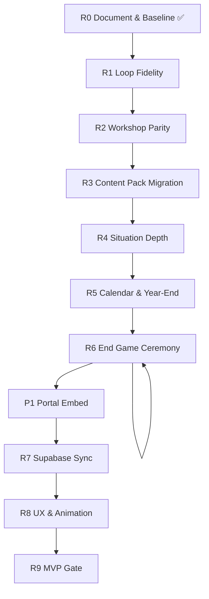

# SPIKE LIFE™ — GDS v1.0 Realignment Phases

**Authority:** [GDS v1.0](./GDS_v1.0/SPIKE_LIFE_GDS_v1.0.pdf)  
**Baseline:** [Gap Analysis](./GDS_v1_GAP_ANALYSIS.md) (2026-06-29)  
**Technical design:** [GDS v1 Realignment Design](../design/GDS_v1_REALIGNMENT_DESIGN.md) — read before coding  
**Supersedes:** Engineering-only sequencing in `IMPLEMENTATION_PHASES.md` for net-new work

This plan closes gaps between the **current build** and **GDS v1.0 MVP scope** (Ch 1 §13). Phases are ordered by dependency and player-visible impact. Each phase ends with testable acceptance criteria tied to GDS chapters.

---

## Principles (non-negotiable)

1. **GDS v1.0 wins** on gameplay conflicts; architecture amendments (A0–A5) win on layering conflicts.
2. **Workshop and solo must converge** on the same planning-cycle semantics; workshop may remain time-compressed but must not skip mandatory steps.
3. **Content pack migration before new situations** — no more hardcoded encounters in `@spike-life/domain`.
4. **No scope creep** — defer Vol VII (AI, analytics, FWAT) unless GDS MVP gate requires it.

---

## Phase map

| Phase | Name | GDS volumes | Target duration | Player-visible outcome |
|-------|------|-------------|-----------------|------------------------|
| **R0** | Document & baseline | All | — | ✅ This commit |
| **R1** | Loop fidelity | Vol I Ch 2–3 | 1 sprint | Campaign mode = 20 cycles; formal cycle FSM |
| **R2** | Workshop parity | Vol I Ch 2–3, 6; Vol III Ch 12 | 1 sprint | Workshop gets timer, calendar, same board UX as solo |
| **R3** | Content pack migration | Vol VI Ch 21, 23; A4 | 1 sprint | Encounters live in PH pack; domain reads pack only |
| **R4** | Situation depth | Vol I Ch 4–5 | 2 sprints | ≥5 playable situations per domain; year-loop drives `presentSituation()` |
| **R5** | Calendar & year-end | Vol I Ch 3 §23–25 | 0.5 sprint | 13th month allocation applies; H2 seasonal weights |
| **R6** | End game ceremony | Vol I Ch 2 §23–25; Vol III Ch 13 | 1 sprint | Multi-player Life Score podium, dimension radar, advisor closing |
| **R7** | Multiplayer infra | Vol III Ch 12; Vol V Ch 20 | 1.5 sprints | Supabase persistence + Realtime; cross-device workshop |
| **P1** | Portal embed | — | 1 sprint | `/life` routes in Portal; Vite aliases; faculty nav |
| **R8** | UX & animation polish | Vol IV Ch 16–18 | 1 sprint | Domain board in workshop, financial health meter, lobby rules |
| **R9** | MVP gate | GDS Ch 1 §15, Ch 2 §27 | Ongoing | 45–60 min playtest pass with 4 players |

**Estimated calendar:** 9–10 engineering sprints to MVP gate (R9 playtest may overlap R8).

---

## R0 — Document & baseline ✅

**Status:** Complete (2026-06-29)

### Delivered

- GDS v1.0 PDF archived: `docs/gdd/GDS_v1.0/SPIKE_LIFE_GDS_v1.0.pdf`
- Searchable extract: `docs/gdd/GDS_v1.0/GDS_v1.0_extracted.txt`
- Gap analysis: `docs/gdd/GDS_v1_GAP_ANALYSIS.md`
- This realignment plan

### Acceptance

- [x] Canonical GDS source in repo
- [x] Chapter index for all 28 chapters
- [x] Build vs spec gap table with code evidence
- [x] Critical defects D1–D6 identified

---

## R1 — Loop fidelity

**Goal:** The engine's default playable path matches GDS time model — **20 semi-annual planning cycles over 10 years**.

**GDS:** Vol I Ch 2 §9, Ch 3 §3–4

### Deliverables

| Layer | Work |
|-------|------|
| **Domain** | Export explicit `PlanningCyclePhase` enum + transition table matching GDS FSM (init → domain → situation → timer → decision → processing → reveal → complete) |
| **Domain** | `CampaignSession` mode: `maxCycles: 20` drives session end; workshop mode keeps `maxMacroTurns: 5` as **compression profile** with documented mapping (1 macro turn = 4 cycles) |
| **Application** | `StartCampaign` vs `StartWorkshop` commands with mode flag on `Simulation` |
| **UI** | Mode selector in lobby: **Campaign (full)** vs **Workshop (45 min)** |
| **UI** | `CycleBadge` shows `Jan–Jun · Year N` throughout campaign |
| **Tests** | `planning-cycle.test.ts` covers 20-cycle completion; `workshop-turn.test.ts` documents compression ratio |

### Acceptance

- [ ] Campaign solo session completes exactly 20 planning cycles before `CampaignComplete`
- [ ] Workshop session completes in 5 macro turns with documented cycle equivalence
- [ ] Planning cycle FSM documented in code matches GDS Ch 3 sequence diagram
- [ ] No player can advance to next cycle while others still deciding (workshop)

### Depends on

R0. Blocks R4 (situations need full cycle count for balancing).

---

## R2 — Workshop parity

**Goal:** Workshop players experience the **same mandatory steps** as solo — timer, auto-advisor, calendar events — not a stripped-down alternate game.

**GDS:** Vol I Ch 2 §11–12, Ch 3 §12–13; Vol III Ch 12

**Fixes defects:** D2

### Deliverables

| Layer | Work |
|-------|------|
| **UI** | Wire `onTimerExpire` on workshop `PlanLens` → `applyAutoAdvisor()` per slot |
| **UI** | Toast: *"Someone else decided for you."* when `source: auto_advisor` |
| **UI** | `ThirteenthMonthModal` + `AnnualCheckpointCard` in `WorkshopWorkspace` |
| **UI** | Replace workshop `StageTrack` with `DomainGridBoard` + `YearRevealSequence` (or unified board component) |
| **Application** | Room-level `cycleDeadlineAt` already on simulation — propagate to all workshop clients |
| **UI** | Facilitator timer preset in `WorkshopLobby`: off / 20 / 15 / 10 / 5s (GDS Ch 2 §15) |

### Acceptance

- [ ] Workshop player timeout triggers auto-advisor decision (not stuck waiting)
- [ ] 13th month modal appears for all workshop players after H2 cycle
- [ ] Annual checkpoint appears once per year in workshop
- [ ] Workshop board shows 12-domain grid reveal (not life-stage track only)
- [ ] Facilitator can set timer before start

### Depends on

R1 (cycle boundaries). Can start UI wiring in parallel with R1 if cycle events are stable.

---

## R3 — Content pack migration

**Goal:** Satisfy GDS Ch 4 §21 and Amendment A4 — **encounters and situations are data, not domain code**.

**GDS:** Vol VI Ch 21, 23; Amendment A4

**Fixes defects:** D5

### Deliverables

| Layer | Work |
|-------|------|
| **Content** | Move `encounter-deck.ts` cards → `content-philippines/data/encounters/` (JSON per domain or single `encounters.json`) |
| **Content** | Schema + validation in `content-core` (IDs, weights, domain, event class, decision options — no financial math) |
| **Domain** | `situation-engine.ts` and year-loop services load encounters via injected pack port |
| **Domain** | Delete hardcoded `ENCOUNTER_DECK` from domain package |
| **Application** | Bootstrap encounters in `bootstrap.ts` alongside year-loop |
| **Tests** | `year-loop-validation.test.ts` extended; smoke: every domain has ≥1 encounter in pack |

### Acceptance

- [ ] Zero encounter definitions in `@spike-life/domain` source
- [ ] Adding a new encounter requires only JSON + validation pass
- [ ] Existing promotion/protection regression tests still pass
- [ ] `npm run test` green in SPIKE_LIFE monorepo

### Depends on

None (can run parallel to R2). Blocks R4.

---

## R4 — Situation depth

**Goal:** `presentSituation()` is driven by **year-loop domain selection**, not hardcoded scenario IDs. Every domain has a playable situation pool.

**GDS:** Vol I Ch 4–5; Vol VI Ch 23

**Fixes defects:** D4

### Deliverables

| Layer | Work |
|-------|------|
| **Content** | Expand PH pack: **≥5 situations per domain** (60 minimum); wire `life-situations.json` IDs to encounter records |
| **Content** | Event class tags: positive / negative / opportunity / crisis / milestone (GDS Ch 5 §10) |
| **Content** | Philippine flavor situations: typhoon, Christmas spend, OFW opportunity, family support, SSS/Pag-IBIG moments |
| **Domain** | `presentSituation()` reads domain from year-loop result, picks weighted situation from pack |
| **Domain** | Domain cooldown + goal-based weighting per GDS Ch 4 §9–11 |
| **Domain** | Pos/neg/opportunity balance governor (target 35/30/20/15) |
| **UI** | Wire `EncounterCardPanel` into main flow; retire duplicate `EncounterModal` if redundant |
| **Tests** | Situation selection tests per domain; no domain repeats 3× in a row |

### Acceptance

- [ ] No `scenarioId` required to start a cycle (domain-driven default)
- [ ] ≥5 situations per domain in PH pack, all playable
- [ ] Promotion + protection stress remain as regression scenarios in test suite
- [ ] Player sees different situations when replaying with same archetype
- [ ] `life-situations.json` IDs resolve to live encounters

### Depends on

R3. Largest content effort in realignment.

---

## R5 — Calendar & year-end completeness

**Goal:** 13th month pay is a **meaningful allocation decision**, not just a cash bump. Annual review matches GDS pacing.

**GDS:** Vol I Ch 2 §21–22, Ch 3 §23–25

**Fixes defects:** D1

### Deliverables

| Layer | Work |
|-------|------|
| **Domain** | Call `allocationToStrategy()` in `resolveThirteenthMonth()` — apply chosen allocation to goal/protection/EF strategy |
| **Domain** | H2 situation weight bump for seasonal events (Christmas, typhoon) in `situation-weights.ts` driven by pack |
| **UI** | Workshop + solo: block cycle advance until 13th month allocation chosen |
| **UI** | Annual checkpoint ≤ 6 metrics + one advisor line; auto-dismiss ≤ 10s (GDS Ch 3 §25) |
| **Tests** | 13th month allocation changes goal portfolio; exactly one per simulation year |

### Acceptance

- [ ] Every simulation year includes exactly one 13th month pay decision
- [ ] Allocation choice affects financial state (not cosmetic)
- [ ] Annual checkpoint completes in ≤ 10 seconds UI time
- [ ] H2 cycles show higher weight for seasonal situations (observable in test fixtures)

### Depends on

R2 (workshop UI), R4 (seasonal situations).

---

## R6 — End game ceremony

**Goal:** Game ends with GDS-compliant **Life Score winner** ceremony for all players.

**GDS:** Vol I Ch 2 §23–25; Vol III Ch 13

**Fixes defects:** D3

### Deliverables

| Layer | Work |
|-------|------|
| **Application** | `GetLifeSummary` query calls `computeCampaignLifeSummary()` for all room players |
| **UI** | `LifeSummaryScreen` — winner podium (2–6 players), dimension scores, optional radar chart |
| **UI** | Facilitator **Reveal winner** button after `workshop_complete` |
| **UI** | Per-player one-sentence advisor closing insight |
| **UI** | Hidden delayed consequences surfaced in summary if triggered |
| **Tests** | Richest player ≠ winner test case; workshop 4-player ranking |

### Acceptance

- [ ] Winner = highest Life Score, not net worth (proven by test fixture)
- [ ] Workshop shows all players ranked with 5 dimension breakdowns
- [ ] Solo campaign shows same screen at cycle 20
- [ ] End screen includes personalized life story paragraph per player

### Depends on

R1 (campaign end), R2 (workshop shell).

---

## R7 — Multiplayer infrastructure

**Goal:** Classroom-ready **simultaneous multiplayer** across devices.

**GDS:** Vol III Ch 12; Vol V Ch 20

### Deliverables

| Layer | Work |
|-------|------|
| **Infrastructure** | Hono API on Cloudflare Workers + Neon (or D1) for `GameRoom` + `Simulation` |
| **Infrastructure** | WebSocket or SSE room channel: join, timer sync, decision submitted, turn advance |
| **Portal** | SPIKE Portal auth — facilitator role, game code issuance from admin/coach dashboard |
| **Application** | HTTP repository adapters replacing in-memory repos |
| **Deploy** | `spike-life` Pages + API worker; CI deploy |
| **Tests** | Integration test: two clients join same code, timer drift < 1s |

### Acceptance

- [ ] Two browsers join same game code and see live player list
- [ ] Timer sync drift < 1s across clients
- [ ] Room survives facilitator browser refresh
- [ ] No PII in game state beyond display names
- [ ] Facilitator authenticated via Portal

### Depends on

R2 (timer semantics worth syncing once realtime exists).

---

## R8 — UX & animation polish

**Goal:** Meet GDS Vol IV presentation rules without changing engine semantics.

**GDS:** Vol IV Ch 16–18

### Deliverables

| Layer | Work |
|-------|------|
| **UI** | Unified `GameStatusBar` replacing split HUDs (GDS Ch 17) |
| **UI** | Financial health indicator: Excellent → Critical (5 levels, GDS Ch 3 §20) |
| **UI** | Consequence reveal: green/red animated deltas on all modes |
| **UI** | `OnboardingRulesCard` in workshop lobby (< 5 min rules, GDS success criteria) |
| **UI** | Advisor consult pauses timer (max 20s, GDS Ch 3 §14) |
| **UX** | Domain selection animation ≤ 3s on all screen sizes |
| **Optional** | Domain audio cues (low priority; may slip post-MVP) |

### Acceptance

- [ ] New player reads rules and starts in < 5 minutes (observed playtest)
- [ ] Financial health visible without opening reports
- [ ] All animations complete within 3 seconds
- [ ] Advisor button pauses countdown; resumes on close

### Depends on

R2, R6 (stable flows to polish).

---

## R9 — MVP gate

**Goal:** Prove GDS success criteria in a real facilitated session.

**GDS:** Ch 1 §15; Ch 2 §27–28; Ch 3 §26

### Deliverables

| Area | Work |
|------|------|
| **Playtest** | Scripted 4-player facilitator run; time each planning cycle |
| **Balancing** | Tune `year-loop.json` weights, timer default, workshop compression |
| **QA** | `npm run smoke:spike-life-workshop` — full path automation |
| **Docs** | Update `BIBLE_CONFORMANCE.md` per phase; mark GDS chapters aligned |

### Acceptance (GDS MVP success criteria)

- [ ] Rules understood in < 5 minutes (observed)
- [ ] Planning cycle averages ~30 seconds
- [ ] 4-player workshop completes in 45–60 minutes
- [ ] Players discuss trade-offs without facilitator prompting (observed)
- [ ] All packages green: `npm run test` + `npm run build:web`
- [ ] Players finish thinking differently about money (playtest survey)

### Depends on

R1–R8 minimum; R7 required for production classroom, optional for first internal playtest on single machine.

---

## Critical defect fast track

These can ship **before** their parent phase as hotfixes:

| Defect | Fix | Phase |
|--------|-----|-------|
| D1 13th month allocation not applied | Wire `allocationToStrategy()` | R5 (can hotfix early) |
| D2 Workshop timer not wired | Add `onTimerExpire` to workshop `PlanLens` | R2 |
| D3 Campaign life summary not wired | Call `computeCampaignLifeSummary()` in end flow | R6 |

---

## Relationship to prior `IMPLEMENTATION_PHASES.md`

| Old phase | Absorbed into |
|-----------|---------------|
| Phase 0 Foundation | ✅ Done → baseline for R0 |
| Phase 1 Time model | R1 |
| Phase 2 Dream board | ✅ Done |
| Phase 3 Timer + auto-advisor | R2 |
| Phase 4 PH calendar | R5 |
| Phase 5 Content depth | R3 + R4 |
| Phase 6 End game | R6 |
| Phase 7 Realtime infra | R7 |
| Phase 8 MVP gate | R9 |

`IMPLEMENTATION_PHASES.md` remains as historical record; **new work follows this document**.

---

## Suggested sprint order (first 4 sprints)

| Sprint | Phases | Outcome |
|--------|--------|---------|
| **Sprint A** | R1 + R2 + D1/D2 hotfixes | Correct time model; workshop timer + calendar |
| **Sprint B** | R3 | Encounters in content pack |
| **Sprint C** | R4 (wave 1) | 30+ situations, domain-driven `presentSituation()` |
| **Sprint D** | R4 (wave 2) + R5 | Full 60 situations; 13th month allocation live |

Sprints E–G: R6, R7, R8, R9.

---

## Governance

- **Design changes** that alter GDS Ch 1–3 loop require written amendment (like A0–A5).
- **Content additions** that don't change engine contracts proceed via PH pack PRs only.
- **MVP gate (R9)** is the only approval to call SPIKE LIFE "GDS v1.0 compliant."
