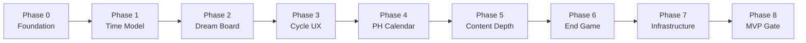

# SPIKE LIFE™ — GDS Implementation Phases

> **Superseded for new work** by [GDS v1 Realignment Phases](./GDS_v1_REALIGNMENT_PHASES.md) (2026-06-29).  
> **Canonical design:** [GDS v1.0 PDF](./GDS_v1.0/SPIKE_LIFE_GDS_v1.0.pdf) · [Gap analysis](./GDS_v1_GAP_ANALYSIS.md)

**Authority:** [Gameplay Summary v1.0](./GAMEPLAY_SUMMARY_v1.md)  
**Engineering map:** [Volume I README](./VOLUME_I/README.md) · [Amendment A5 Year Loop](../architecture/AMENDMENT_A5_YEAR_LOOP.md)  
**Last updated:** 2026-06-26 (historical); see realignment doc for current plan

This document turns the approved GDS into **sequenced delivery phases**. Each phase has a player-visible outcome, engineering deliverables, and acceptance criteria. Phases are ordered by dependency; later phases assume earlier ones are stable.

---

## How to read this

| Column | Meaning |
|--------|---------|
| **GDS** | Sections from Gameplay Summary v1.0 |
| **Packages** | Primary code locations |
| **Mode** | `Workshop` = compressed facilitator session; `Campaign` = full 10-year GDS |

Workshop mode may stay shorter than Campaign (e.g. 5 macro turns today) while Campaign reaches 20 planning cycles. Phases call out which mode each milestone targets.

---

## Phase map

---

## Phase 0 — Foundation ✅ Shipped

**Goal:** Credible multiplayer workshop with diverse starting lives and a playable year loop.

| GDS | §3 players, §5 join flow, §11 domain board, §22 simultaneous multiplayer (basic) |
|-----|----------------------------------------------------------------------------------|

### Delivered

| Area | What shipped |
|------|----------------|
| **Players** | 2–6 workshop slots; min 2 to start (`GAME_ROOM_MIN_PLAYERS` / `GAME_ROOM_MAX_PLAYERS`) |
| **Personas** | 6 PH archetypes; random unique assignment at join (`archetypes.json`, `archetype-selection.ts`) |
| **Year loop** | Content-pack weights, domain grid, reveal UI (`year-loop.json`, `YearRevealSequence`, `DomainGridBoard`) |
| **Engines** | FNA, decision, consequence, reflection, Life Score (`domain/services/*`) |
| **Workshop UI** | Lobby, facilitator panel, board tokens, per-player lenses |
| **Solo UI** | `LifeWorkspace` with board welcome + persona on year one |

### Acceptance (met)

- [x] Six players can join one room with six different personas
- [x] Facilitator cannot start with fewer than two players
- [x] One shared macro turn completes for all players in parallel
- [x] Domain → situation → decision → reflection loop works end-to-end

---

## Phase 1 — Time Model & Campaign Length ✅ Shipped

**Goal:** Replace “one decision = one calendar year” workshop compression with the GDS **semi-annual planning cycle** model, while keeping workshop mode configurable.

| GDS | §3 game length, §4 time progression |
|-----|--------------------------------------|

### Delivered

- `campaign.json` — 10 years · 20 cycles · 5 workshop macro turns
- `cycleIndex`, `halfYear`, `cycleLabel` on dashboard (`Jan–Jun · Year N`)
- `planning-cycle.ts` + `campaign-context.ts` bootstrap from content pack

### Acceptance

- [x] Full campaign config defines 20 planning cycles over 10 years
- [x] Workshop mode completes in 5 macro turns
- [x] Age increments with simulation year at macro boundaries
- [x] Unit tests: `planning-cycle.test.ts`, updated `workshop-turn.test.ts`

---

## Phase 2 — Life Blueprint (Dream Board) ✅ Shipped

### Delivered

- `DreamBoardSetup` UI — toggle goals, inflation-adjusted future values, auto emergency fund
- `setDreamBoard` command; blocks planning until complete (workshop auto-applies defaults on join)
- Goals flow into `goalPortfolio` for FNA and Life Score

### Acceptance

- [x] Solo players complete dream board before first cycle
- [x] Emergency fund target = 6× monthly income
- [x] Workshop join auto-completes blueprint with defaults

---

## Phase 3 — Planning Cycle UX (Timer & Auto-Advisor) ✅ Shipped

**Goal:** Each cycle feels fast and exciting; indecision has a teaching consequence.

| GDS | §14 Decision Timer, §15 Auto Advisor, §25 UX principles |
|-----|---------------------------------------------------------|

### Deliverables

| Layer | Work |
|-------|------|
| **Domain** | `DecisionTimer` config: `off | 20s | 15s | 10s | 5s`. On expiry → `autoAdvisorSelect()` using recommendation engine (conservative balanced pick, **not** random). |
| **Game room** | Room-level timer start when facilitator starts cycle; all players share deadline |
| **Application** | `StartPlanningCycle` emits `cycleDeadlineAt`; `RecordDecision` accepts `source: player | auto_advisor` |
| **UI** | Countdown ring on `PlanLens`; facilitator setting in lobby. Toast when auto-advisor acts: *“Someone else decided for you.”* |
| **UI** | Optional advisor assistance button — trade-off copy only (`AdvisorInsightPrompt` pattern) |

### Acceptance

- [ ] Default workshop timer = 15 seconds
- [ ] Timer expiry applies a conservative advisor decision and marks it in turn history
- [ ] Planning cycle wall-clock target ~30 seconds (domain + timer + one tap)
- [ ] Facilitator can disable timer for training mode

### Depends on

Phase 1 (cycle start semantics).

### Estimated scope

**Medium** (1 sprint).

---

## Phase 4 — Philippine Calendar Events

**Goal:** Authentic rhythm of Philippine financial life across the year.

| GDS | §19 13th Month Pay, §21 Financial Checkpoints, §20 Philippine Flavor (calendar hooks) |
|-----|--------------------------------------------------------------------------------------|

### Deliverables

| Layer | Work |
|-------|------|
| **Domain** | After H2 (Jul–Dec) cycle: inject `ThirteenthMonthPayEvent` — mandatory bonus = 1× monthly income |
| **Domain** | Player chooses **one** primary allocation: celebrate, travel, EF, business, retirement, education, house, protection, debt |
| **Domain** | Annual checkpoint at year boundary: cash flow, net worth, EF, protection, goal progress, Life Score snapshot, advisor insight |
| **Content** | Allocation options + copy in PH pack; weight seasonal situations (Christmas spend, typhoon) toward H2 |
| **UI** | `ThirteenthMonthModal`, `AnnualCheckpointCard` — brief, non-blocking where possible |

### Acceptance

- [ ] Every simulation year includes exactly one 13th month pay decision
- [ ] Annual checkpoint appears once per year with ≤ 6 metrics + one advisor line
- [ ] Workshop compression maps 13th month to appropriate macro turn (e.g. every turn or odd turns — tunable in pack)

### Depends on

Phase 1, Phase 2 (goal allocation choices matter).

### Estimated scope

**Medium** (1 sprint).

---

## Phase 5 — Situation & Content Depth

**Goal:** Every life domain has a rich, weighted situation deck; outcomes feel persona-specific.

| GDS | §10–13 Game Board, Situation Engine, Player Decision, §20 Philippine Flavor |
|-----|----------------------------------------------------------------------------|

### Deliverables

| Layer | Work |
|-------|------|
| **Content** | Move encounter deck from `domain/gameboard/encounter-deck.ts` → `content-philippines/encounters/` per domain |
| **Content** | Situations weighted by age, career, marital status, income, goals, prior decisions (extend `situation-weights.ts`) |
| **Domain** | `presentSituation()` reads pack only — no hard-coded promotion/protection scenarios in code |
| **Content** | Philippine doodads: motorcycle, phone, jewelry, family support, OFW opportunity — as encounter tags |
| **UI** | `EncounterCardPanel` shows domain-themed art/copy from pack strings |

### Acceptance

- [ ] ≥ 5 situations per active domain in PH pack
- [ ] Same domain can yield different situations based on player state weights
- [ ] No financial math in content JSON — only IDs, weights, narrative, scenario routing
- [ ] Promotion + protection stress remain as regression scenarios in tests

### Depends on

Phase 0 year loop, Phase 2 goals (weight inputs).

### Estimated scope

**Large** (2+ sprints, content-heavy).

---

## Phase 6 — End Game & Life Score Winner

**Goal:** Finish feels celebratory; winner is **most balanced life**, not richest.

| GDS | §17 Consequences (summary), §23 Winning, §5 Life Summary |
|-----|-----------------------------------------------------------|

### Deliverables

| Layer | Work |
|-------|------|
| **Domain** | `computeCampaignLifeScore()` — aggregate Financial Security, Protection Readiness, Goal Achievement, Wealth Creation, Life Stability (see [Ch 8 Scoring](./VOLUME_I/CHAPTER_08_SCORING.md)) |
| **Domain** | `WorkshopComplete` / `CampaignComplete` events with final rankings |
| **Application** | `GetLifeSummary` query — per-player narrative + dimension breakdown |
| **UI** | `LifeSummaryScreen` — winner podium, dimension radar, goal completion, advisor closing insight |
| **Workshop** | Facilitator “Reveal winner” after `workshop_complete`; compare all six players |

### Acceptance

- [ ] Winner determined by highest overall Life Score, not net worth alone
- [ ] End screen shows five dimension scores + one sentence per player
- [ ] Hidden long-term consequences surfaced in summary if they fired during play
- [ ] Workshop mode ends cleanly after configured macro turns

### Depends on

Phase 2 goals, Phase 4 checkpoints (historical snapshots).

### Estimated scope

**Medium** (1 sprint).

---

## Phase 7 — Infrastructure & Realtime Multiplayer

**Goal:** Workshop runs reliably across devices in a classroom, not only same-browser demo.

| GDS | §22 Simultaneous Multiplayer (production) |
|-----|------------------------------------------|

### Deliverables

| Layer | Work |
|-------|------|
| **Infrastructure** | Hono API + Neon persistence for `GameRoom` and `Simulation` repos |
| **Infrastructure** | WebSocket or SSE room channel — slot join, timer sync, decision submitted, turn advance |
| **Portal** | SPIKE Portal auth — facilitator role, game code issuance |
| **Application** | Replace in-memory repos with HTTP adapters; optimistic UI + reconcile |
| **Deploy** | `spike-life.pages.dev` + API worker; CI deploy for both |

### Acceptance

- [ ] Two browsers join same game code and see live player list
- [ ] Timer drift < 1s across clients
- [ ] Room survives facilitator browser refresh
- [ ] No PII in game state beyond display names

### Depends on

Phase 3 (timer sync worth doing once realtime exists).

### Estimated scope

**Large** (2+ sprints).

---

## Phase 8 — MVP Success Gate & Balancing

**Goal:** Prove the GDS success criteria in a real 45–60 minute session.

| GDS | §25 MVP Success Criteria, §24 Design Principles |
|-----|------------------------------------------------|

### Deliverables

| Area | Work |
|------|------|
| **Playtest** | Scripted 4-player facilitator run; time each planning cycle |
| **Balancing** | Tune `year-loop.json` weights, decision capacities, inflation, timer default |
| **UX** | Rules card / 5-minute onboarding in lobby |
| **QA** | Smoke: `npm run smoke:coach-compose` equivalent for full workshop path |
| **Docs** | Update [BIBLE_CONFORMANCE](../architecture/BIBLE_CONFORMANCE.md) per phase |

### Acceptance

- [ ] New player understands rules in < 5 minutes (observed playtest)
- [ ] Planning cycle averages ~30 seconds
- [ ] 4-player workshop completes in 45–60 minutes
- [ ] Players discuss trade-offs without facilitator prompting (observed)
- [ ] All packages green: `npm run test` + `npm run build:web`

### Depends on

Phases 1–6 (minimum); Phase 7 for production workshops.

### Estimated scope

**Ongoing** — final gate, not a feature sprint.

---

## Cross-phase engineering conventions

1. **Content pack first** — tunables live in `@spike-life/content-philippines`, not domain code ([A4](../architecture/AMENDMENT_A4_PHILIPPINES_GLOBAL_READY.md)).
2. **Board paces; FDE decides** — randomness selects situations; engines compute money ([A0](../architecture/A0_CORE_DESIGN_REORIENTATION.md)).
3. **One major decision per planning cycle** — never expose bookkeeping UI.
4. **CQRS** — new player actions → command on `FinancialDecisionCommandBus` or `GameRoomCommandBus`; reads via query buses.
5. **Tests per phase** — domain unit tests required before UI; orchestrator test for any multiplayer behavior change.

---

## Suggested delivery order (summary)

| Order | Phase | Player-visible milestone |
|-------|-------|--------------------------|
| — | **0** ✅ | Join workshop, get random persona, play one year |
| 1 | **Time model** | “Jan–Jun Year 2” instead of only “Year 2” |
| 2 | **Dream board** | Set home/travel/retirement goals before life starts |
| 3 | **Timer** | 15-second decisions; auto-advisor if you freeze |
| 4 | **PH calendar** | 13th month pay + annual review |
| 5 | **Content** | Typhoon, Christmas, OFW — domain-specific situations |
| 6 | **End game** | Life Score winner ceremony |
| 7 | **Realtime** | Phones + laptops in same room, live sync |
| 8 | **MVP gate** | 45–60 min validated workshop |

---

## Related documents

- [Gameplay Summary v1.0](./GAMEPLAY_SUMMARY_v1.md) — approved player-facing spec
- [Volume I GDD](./VOLUME_I/README.md) — system design chapters
- [Amendment A5 — Year Loop](../architecture/AMENDMENT_A5_YEAR_LOOP.md) — canonical loop
- [Bible Conformance](../architecture/BIBLE_CONFORMANCE.md) — engineering phase history (Phases 2–5)
