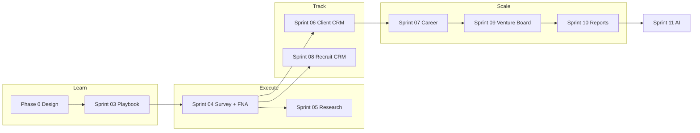

# SPIKE Master Development Roadmap

**Version:** 2.0 (integrated)  
**North star:** [`PRD_SPIKE_VENTURE_BLUEPRINT_V1.md`](./PRD_SPIKE_VENTURE_BLUEPRINT_V1.md)  
**Philosophy:** **Learn → Execute → Track → Scale**

This document reconciles three sources into one sequence:

1. **Phase 0 + Sprints 01–03** (shipped in repo)
2. **Original PRD gap-analysis phases** (Blueprint OS engines A–F)
3. **Your Sprints 04–11 proposal** (Execution, Research, CRM, Career, Board, Reports, AI)

---

## Design principle (the fix)

| Old split (debt risk) | Integrated decision |
|----------------------|---------------------|
| Sprint 04: partial automation only | Sprint 04: **full Execution & Activity Engine** — Survey + FNA + Timeline + Blueprint auto-update |
| Sprint 06: build FNA again inside CRM | Sprint 06: **Client CRM wraps the FNA engine built in Sprint 04** — pipeline + profiles + referrals, not a second FNA |
| Playbook content vs production engines in parallel | **Learn (Playbook) → Execute (Survey/FNA) → Track (Timeline/CRM) → Scale (Career/Board/Reports)** |

**Rule:** Build each engine **once** at the narrowest sprint that needs it; later sprints **extend** it, never duplicate it.

---

## Roadmap at a glance

```text
PHASE 0   Strategy & Design                    ✅ Complete
SPRINT 01 Platform Refactor                     ✅ Complete
SPRINT 02 Instructional Architecture Substrate  ✅ Complete
SPRINT 03 Playbook Engine & Curriculum          ✅ Mostly complete
SPRINT 04 Execution & Activity Engine           🟡 In progress (PR1 shipped)
SPRINT 05 Research Squad Intelligence           ⏳
SPRINT 06 Client Development CRM                ⏳
SPRINT 07 ACS Career Accelerator                ⏳
SPRINT 08 Recruitment & Agency Builder CRM     ⏳
SPRINT 09 Venture Board System                  ⏳
SPRINT 10 Reports & Portfolio Generator           ⏳
SPRINT 11 AI Layer                              ⏳ Future
```

---

## Comparison: three plans → one sequence

| Sprint | Repo plan (before) | Your proposal | **Integrated v2** |
|--------|-------------------|---------------|-------------------|
| **04** | Portfolio automation only; survey in PR2; FNA “stub” in PR3 | Survey + FNA + Timeline + auto Blueprint | **Same as your proposal** — rename from “Portfolio Automation” to **Execution & Activity Engine**; absorb old PR2–4 |
| **05** | Research page placeholder | Research Squads + segments + dashboard | **Your proposal** — depends on Survey Engine (04) |
| **06** | FNA & Client CRM (rebuild FNA) | Full Client CRM | **Your proposal** — CRM **consumes** `financial_needs_analyses` from 04 |
| **07** | Mixed in PRD Phase D | ACS Career Accelerator | **Your proposal** — `career_positions`, readiness dashboard, promotion simulator |
| **08** | Venture Board in PRD Phase D | Recruitment CRM separate from Client | **Your proposal** — splits recruitment/leadership from client pipeline |
| **09** | Reports deferred | Venture Board workflow | **Your proposal** — Hour 200/400/600 state machine |
| **10** | Export center | Reports & Portfolio Generator | **Merged** — PDF packets + transcripts + certificates |
| **11** | AI readiness schema only | Full AI coach layer | **Your proposal** — after real data exists |

---

## What is already shipped (baseline)

| Sprint | Status | Key assets in repo |
|--------|--------|-------------------|
| **01** | ✅ | Auth, roles, nav, dashboards, `20260606_sprint_01_scaffold.sql` |
| **02** | ✅ | `playbook.ts`, `/content` tree, curriculum tables, Blueprint shell, artifact tables |
| **03** | ✅ ~90% | Sessions, role Playbook views, `playbookProgress`, `playbook_completions` migration |
| **03 follow-on** | ⏳ | Day 2+ content, DB curriculum import, mentor coaching notes persistence |
| **04** | 🟡 PR1 | `playbookAutomation.js`, worksheet/activity/reflection → Blueprint, `blueprintTimeline.js` |

**Not yet operational:** Survey taker, FNA record, unified timeline UI, Market Intelligence auto-fill from surveys.

---

## Sprint 04 — Execution & Activity Engine

**Theme:** *Execute* — participants do real work; Blueprint updates itself.

**Outcome:** SPIKE becomes **operational**, not just curricular.

### Build (4 PRs)

| PR | Scope | Delivers |
|----|--------|----------|
| **4.1** | Survey Engine | Question types: multiple choice, single select, rating, open text, ranking. `SurveyViewer.jsx`, responses table, Playbook integration |
| **4.2** | FNA Engine (v1 — build once) | `financial_needs_analyses` + recommendations child. Client profile, income, assets, liabilities, protection gap, retirement gap. Standalone FNA module + Playbook hook |
| **4.3** | Timeline Engine | `participant_timeline_events` migration. Unified feed: activities, surveys, FNAs, coaching, submissions. Blueprint header widget |
| **4.4** | Blueprint auto-update matrix | Extend `playbookAutomation.js`: Survey → Market Intelligence; FNA → Client Growth; Reflection → Vision (done); worksheet → Vision/Canvas (done) |

### Automation examples (acceptance)

```text
Complete Survey        → portfolio-market-intelligence + timeline event
Complete FNA           → client_growth funnel stage + timeline event
Complete Reflection    → portfolio-identity-purpose (shipped)
Complete Worksheet     → Vision & Purpose + Business Plan ch. (shipped)
```

### DB (single migration file)

- `survey_responses`, `survey_response_answers`
- `financial_needs_analyses`, `fna_recommendations`
- `participant_timeline_events`
- `coaching_sessions` (minimal — timeline visibility)

### Deprecate

- Mock `fnaCompletion` / `portfolioPct` from hours-only (`sprint01Metrics.js`) as each real engine goes live

**Maps to PRD engines:** 7 Survey, 8 FNA, 10 Timeline, 2 Playbook Integration (complete)

---

## Sprint 05 — Research Squad Intelligence System

**Theme:** *Learn at scale* — surveys from Sprint 04 power cohort research.

**Prerequisite:** Survey Engine (04)

### Build

- Research squads (cohort-scoped) — extend `research_squads` / `research_projects`
- Market segments: Gen Z, Young Professionals, Families, OFWs, Business Owners, Healthcare Professionals
- **Research dashboard:** responses, trends, personas, opportunity maps
- Auto-deliverables: research report draft, deck inputs, portfolio artifacts → **Market Intelligence** in Blueprint

### Output

Field research is visible, analyzable, and feeds Venture Blueprint without manual copy-paste.

**Maps to PRD engines:** 6 Research Squad, 7 Survey (analytics), 13 Content (research survey families)

---

## Sprint 06 — Client Development CRM

**Theme:** *Track* — advisor pipeline for real client work.

**Prerequisite:** FNA Engine v1 (04) — **extend, do not rebuild**

### Build

| Module | Pipeline |
|--------|----------|
| **Prospect pipeline** | Prospect → Contacted → Appointment → FNA → Proposal → Application → Issued |
| **Client profile** | Demographics, linked FNA, notes, activity history |
| **Referral engine** | Client → Referral → Prospect |
| **Client Growth dashboard** | KPI strip powering Blueprint **Client Growth Engine** |

### Technical rule

- CRM stages **reference** `financial_needs_analyses.id`
- FNA form component is **shared** between Playbook field activity and CRM appointment outcome
- New tables: `prospects`, `client_profiles`, `pipeline_stages`, `referrals` — not a second FNA schema

**Maps to PRD engines:** 3 Client Growth, 8 FNA (operational use), Module 3 Financial Entrepreneurship Canvas (production data)

---

## Sprint 07 — ACS Career Accelerator

**Theme:** *Scale yourself* — ACS 3.0 visible and motivating.

### Build

- Career ladder DB: Advisor → AUM → UM → SUM → Agency Director
- `career_positions`, `position_qualifications` (admin-configurable)
- **Readiness dashboard:** Production, Recruitment, Activation, Leadership, Persistency
- **Promotion simulator:** “Current: Advisor → Need: 1 recruit + production target → Reach: AUM”

### Feeds

- Blueprint **Career Accelerator** module
- SPIKE Readiness Score production dimension (real data, not hours mock)

**Maps to PRD engines:** 4 Agency Builder Roadmap, 6 Career Accelerator module

---

## Sprint 08 — Recruitment & Agency Builder CRM

**Theme:** *Scale your agency* — separate from Client CRM.

### Build

| Module | Pipeline |
|--------|----------|
| **Recruit pipeline** | Lead → Interview → Candidate → Licensed → Activated → Productive |
| **Team dashboard** | Recruits, licensing, activation, production by downline |

### Feeds

- Blueprint **Recruitment Engine**
- Blueprint **Leadership Engine**
- Career Accelerator readiness inputs

**Maps to PRD engines:** 4 Recruitment (Agency Builder track), 5 Leadership

---

## Sprint 09 — Venture Board System

**Theme:** *Prove it* — Hour 200 / 400 / 600 capstone workflow.

### Build

- `venture_board_submissions` state machine: Ready → Mentor Review → Faculty Review → Board Review → Presentation → Decision
- Rubrics, scheduling, feedback, decisions
- Packet auto-assembly from Blueprint modules (read-only compile)

**Maps to PRD engines:** 12 Venture Board Workflow, Module 8 Venture Board

---

## Sprint 10 — Reports & Portfolio Generator

**Theme:** *Export value* — participants leave with assets.

### Generate

- SPIKE Venture Blueprint™ PDF
- Agency Builder Blueprint / Specialist Practice Blueprint
- Venture Board packet
- Participant transcript
- Completion certificates

**Prerequisite:** Real state from Sprints 04–09 (not mock metrics)

**Maps to PRD engines:** 14 Reporting Center, Module 10 Export Center

---

## Sprint 11 — AI Layer (future)

**Prerequisite:** Event bus + clean participant state + timeline history

| Agent | Input |
|-------|--------|
| AI Mentor | Program state + timeline |
| AI FNA Coach | FNA record + gaps |
| AI Recruitment Coach | Recruit pipeline |
| AI Presentation Coach | Board packet draft |
| AI Venture Board Reviewer | Rubric + submission |
| AI Career Navigator | Readiness + ladder |

**Maps to PRD engines:** 15 AI Readiness

---

## Participant journey (how it should feel)



---

## Sprint 03 completion checklist (before 04.1)

Finish these so Sprint 04 plugs into a stable Playbook:

- [ ] Day 2 minimal content bundle (Week 1 acceptance path)
- [ ] Apply `20260621_sprint_03_playbook_completions.sql` in Supabase
- [ ] Mentor coaching notes persistence (optional table or `coaching_sessions`)
- [ ] Sprint 03 PR5–6 from [`SPRINT_03_PLAYBOOK_EXECUTION_PLAN.md`](./SPRINT_03_PLAYBOOK_EXECUTION_PLAN.md)

---

## Sprint 04 execution checklist (replaces old SPRINT_04 doc scope)

| Old `SPRINT_04` PR | New home |
|--------------------|----------|
| PR1 Automation core | ✅ Done — becomes 4.4 foundation |
| PR2 Survey path | **4.1 Survey Engine** |
| PR3 FNA stub | **4.2 FNA Engine (full v1)** |
| PR4 Supabase timeline | **4.3 Timeline Engine** |

See [`SPRINT_04_EXECUTION_ACTIVITY_ENGINE.md`](./SPRINT_04_EXECUTION_ACTIVITY_ENGINE.md) for PR-level file targets.

---

## What we intentionally do not do

- Build FNA twice (04 + 06)
- Jump to Venture Board or Reports before Survey/FNA/Timeline are real
- AI before participant state is trustworthy
- Full Segment 1–5 day content before execution engines prove the loop on Day 1–2

---

## Document map

| Doc | Role |
|-----|------|
| **This file** | Canonical sprint sequence Sprints 04–11 |
| [`SPRINT_03_PLAYBOOK_EXECUTION_PLAN.md`](./SPRINT_03_PLAYBOOK_EXECUTION_PLAN.md) | Playbook detail (mostly done) |
| [`SPRINT_04_EXECUTION_ACTIVITY_ENGINE.md`](./SPRINT_04_EXECUTION_ACTIVITY_ENGINE.md) | Next sprint PR breakdown |
| [`PRD_SPIKE_VENTURE_BLUEPRINT_V1.md`](./PRD_SPIKE_VENTURE_BLUEPRINT_V1.md) | Module + engine specifications |
| [`PLAYBOOK_SCHEMA_V1.md`](./PLAYBOOK_SCHEMA_V1.md) | Curriculum domain model |

**END**
