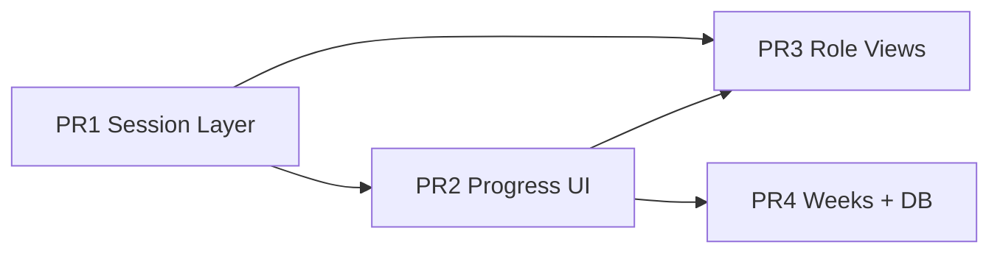

# Sprint 03 — Playbook Engine & Curriculum Execution Layer

**North star:** [`PRD_SPIKE_VENTURE_BLUEPRINT_V1.md`](./PRD_SPIKE_VENTURE_BLUEPRINT_V1.md) (curriculum flows *into* Blueprint in Sprint 04)  
**Baseline:** Sprint 01 platform + Sprint 02 instructional substrate (content tree, viewers, DB scaffold)  
**Strategy:** Small PRs; each leaves `main` deployable. JSON content first; DB progress tables before Supabase writes.

---

## Objective

Make `/playbook` a **fully functional curriculum execution layer** with role-specific views:

```text
Segment → Week → Day → Session
```

| Role | Experience |
|------|------------|
| **Participant (intern)** | Today's session, activities, worksheets, completion |
| **Faculty** | Slides, speaker notes, facilitator guide, debrief |
| **Mentor** | Progress, submissions, coaching notes |

---

## PR breakdown

### PR 1 — Session layer + content model

- Types: `Reflection`, `FacilitatorGuide`, session bundle extensions
- Content: `sessions.json`, `reflections.json`, `facilitator-guide.json` for Day 1
- Extend `contentLoader.js` + `curriculumService.js`
- This execution plan doc

**Exit:** Day 1 bundle includes sessions, reflections, facilitator guide.

---

### PR 2 — Progress + session UI

- `playbookProgress.js` — worksheets, activities, reflections, day completion %
- `SessionView.jsx`, `ReflectionViewer.jsx`, `DayCompletionBar.jsx`
- `ParticipantDayView.jsx` — session tabs + completion tracking

**Exit:** Intern sees session-scoped day view with completion bar.

---

### PR 3 — Role-specific Playbook views

- `FacultyPlaybookView.jsx` — facilitator guide + full speaker notes mode
- `MentorPlaybookView.jsx` — intern progress + worksheet submissions
- `PlaybookShell` routes by role (`intern` / `faculty` / `mentor` / `admin`)

**Exit:** Faculty and mentor land on purpose-built Playbook surfaces.

---

### PR 4 — Segment 1 structure + DB progress

- Week 2–5 `week.json` stubs under `content/segment-1/`
- Migration: `playbook_completions` (participant progress persistence)
- `supabase/playbookProgress.js` — optional Supabase sync
- README sprint naming alignment

**Exit:** Full Segment 1 week ladder visible; progress can persist to DB when migration applied.

---

### PR 5 — Day 2 content + mentor coaching notes *(follow-on)*

- Minimal Day 2 bundle (acceptance path: Week 1 / Day 1–2)
- Mentor coaching notes on submissions

---

### PR 6 — DB curriculum import path *(follow-on)*

- Publish curriculum tree from Supabase
- Faculty content admin read path

---

## Dependency graph



---

## Per-PR verification

| Check | PRs |
|-------|-----|
| `npm run lint` | All |
| `npm run build` | All |
| `npm run smoke:content:loader` | 1, 4 |
| Playbook Day 1 manual (intern + faculty) | 2, 3 |
| `npm run deploy:prod` | 4 |

---

## Out of scope (Sprint 04+)

- Worksheet → Blueprint automation (Sprint 04)
- Research squad surveys (Sprint 05)
- FNA CRM (Sprint 06)
- Venture Board workflow (Sprint 08)
- PDF export (Sprint 09)

**END**
