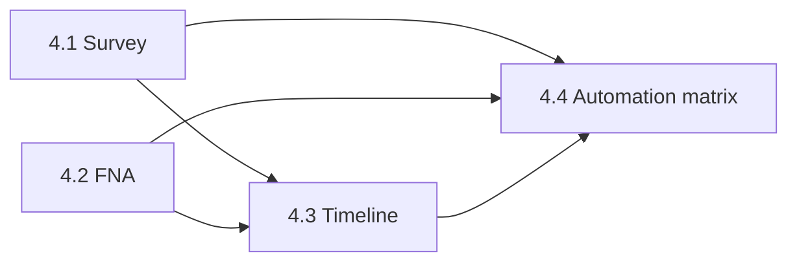

# Sprint 04 — Execution & Activity Engine

**Master roadmap:** [`SPIKE_MASTER_ROADMAP.md`](./SPIKE_MASTER_ROADMAP.md)  
**Replaces:** narrow “Portfolio Automation” scope in [`SPRINT_04_PORTFOLIO_AUTOMATION_PLAN.md`](./SPRINT_04_PORTFOLIO_AUTOMATION_PLAN.md)  
**Philosophy step:** **Execute** (Learn → **Execute** → Track → Scale)

---

## Objective

Participants do **real work** — surveys, FNAs, reflections — and Venture Blueprint updates automatically via Timeline + automation matrix.

**Exit criterion:** Intern completes a survey and sees Market Intelligence update; completes an FNA and sees Client Growth update; both appear on timeline within seconds.

---

## Baseline (already shipped)

- `playbookAutomation.js`, `playbookBlueprintSync.js`
- Worksheet / activity / reflection → Vision & Purpose (Day 1)
- `blueprintTimeline.js` (localStorage)
- `playbook_completions` migration + optional Supabase sync

---

## PR 4.1 — Survey Engine

### Types

- Extend `playbook.ts`: `SurveyResponse`, ranking option type

### UI

- `SurveyViewer.jsx` — multiple choice, single select, rating, open text, ranking
- Replace dashed “survey definition” block in `SessionView` / `DayView`

### Data

- Migration: `survey_responses`, `survey_response_answers`
- `src/lib/surveyService.js` — submit + list own responses
- Mapping: `SURVEY_BLUEPRINT_MAPPINGS` in `activityBlueprintMappings.js`

### Automation

- On submit → `runPlaybookAutomation` → `portfolio-market-intelligence` + timeline event

### Content

- Wire Day 1 `survey.json` as first interactive survey (or Week 2 market survey when published)

---

## PR 4.2 — FNA Engine (build once)

### Types

- `FinancialNeedsAnalysis`, `FnaRecommendation`, protection/retirement gap shapes

### UI

- `FnaEngineModule.jsx` under Blueprint `/venture-blueprint/client-growth` or sub-route `/fna`
- Multi-step form: client profile, income, assets, liabilities, gaps, recommendations

### Data

- Migration: `financial_needs_analyses`, `fna_recommendations`
- `src/lib/fnaService.js` — CRUD own FNAs

### Automation

- On FNA save → update `client_growth` funnel counters (table or computed view) + timeline + Blueprint Client Growth panel

### Rule for Sprint 06

- Export `FnaForm` / `fnaService` for CRM reuse — **no duplicate schema**

---

## PR 4.3 — Timeline Engine

### Data

- Migration: `participant_timeline_events`
- `src/lib/timelineService.js` — append + fetch (Supabase); migrate from `blueprintTimeline.js`

### UI

- `BlueprintTimelineFeed.jsx` in Blueprint shell header + intern dashboard snippet
- Event types: `playbook_complete`, `survey_submit`, `fna_save`, `coaching_note`, `board_submit`

### Coaching (minimal)

- `coaching_sessions` table + mentor quick-add from Mentor Playbook view

---

## PR 4.4 — Automation matrix + cleanup

### Extend `playbookAutomation.js`

| Source | Blueprint target |
|--------|------------------|
| Worksheet | Vision, Canvas chapters (existing) |
| Activity | Portfolio sections (existing) |
| Reflection | Vision (existing) |
| Survey | Market Intelligence |
| FNA | Client Growth Engine |

### Deprecate mocks

- Replace `fnaCompletion` / hour-derived portfolio % in `sprint01Metrics.js` where real data exists
- Staff reports read from timeline + completions

### Verification

- `npm run lint && npm run build && npm run deploy:prod`
- Manual: Survey → Blueprint Market Intelligence; FNA → Client Growth; both on timeline

---

## Dependency graph

---

## Files likely touched

| Area | Paths |
|------|-------|
| Survey | `src/components/playbook/SurveyViewer.jsx`, `src/lib/surveyService.js` |
| FNA | `src/components/fna/*`, `src/lib/fnaService.js` |
| Timeline | `src/components/blueprint/BlueprintTimelineFeed.jsx`, `src/lib/timelineService.js` |
| Automation | `src/lib/playbookAutomation.js`, `activityBlueprintMappings.js` |
| DB | `supabase/migrations/20260622_sprint_04_execution_engine.sql` |
| Blueprint UI | `BlueprintModulePanels.jsx`, `ClientGrowthPanel` |

---

## Out of scope (Sprint 05+)

- Research squad analytics dashboard (Sprint 05)
- Full prospect CRM pipeline (Sprint 06)
- Career ladder admin (Sprint 07)

**END**
