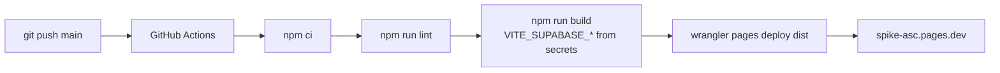

# Sprint 05 — Venture Blueprint Integration Engine

**Product:** SPIKE ASC  
**Master roadmap:** [`SPIKE_MASTER_ROADMAP.md`](./SPIKE_MASTER_ROADMAP.md)  
**PRD:** [`PRD_SPIKE_VENTURE_BLUEPRINT_V1.md`](./PRD_SPIKE_VENTURE_BLUEPRINT_V1.md)  
**Prior sprint:** [`SPRINT_04_EXECUTION_ACTIVITY_ENGINE.md`](./SPRINT_04_EXECUTION_ACTIVITY_ENGINE.md)  
**Production:** https://spike-asc.pages.dev

---

## Document purpose

This file is the **single planning reference** for Sprint 05. It:

1. Describes the **current build framework and runtime flow** (as shipped after Sprint 04).
2. States the **Sprint 05 objective** (Venture Blueprint as primary workspace with auto-population).
3. Maps **each Sprint 05 phase** to what exists today vs what must be built.
4. Notes **alignment** with the integrated master roadmap (Sprint 05 there is Research Squad — see [Roadmap alignment](#roadmap-alignment)).

---

## Current build framework

### Stack

| Layer | Technology | Notes |
|-------|------------|--------|
| Frontend | Vite 8 + React 19 + React Router 7 | SPA; `src/` is the product codebase |
| Styling | Tailwind CSS 3 | Utility-first; blueprint/playbook shells |
| Auth + data (production) | Supabase (PostgreSQL + RLS) | Primary persistence; anon key in Vite build |
| Optional local API | `api/` Express + Prisma + SQLite | JWT dev only; **not** production data path |
| Deploy | GitHub Actions → Wrangler → Cloudflare Pages | Push to `main`; secrets in GitHub |
| Mobile | Capacitor 8 | Wraps Vite build; `CAPACITOR=true` for native asset paths |

### Repository layout (product-relevant)

```text
src/
  App.jsx                 → SpikeMasterPortal (single router shell)
  routes/paths.js         → Canonical routes, role nav, default landing
  pages/
    VentureBlueprintShell.jsx   → /venture-blueprint/*
    PlaybookShell.jsx             → /playbook
    ResearchPage.jsx              → /research (stub)
  components/
    blueprint/              → Blueprint OS UI (modules, timeline, header)
    playbook/               → SurveyViewer, DayView, SessionView, …
    fna/                    → FnaEngineModule, FnaForm
    dashboard/              → Role dashboards, traction, metrics cards
    nav/ModuleNav.jsx       → Role-filtered top navigation
  lib/
    playbookAutomation.js         → Dispatcher (worksheet/activity/reflection/survey)
    playbookBlueprintSync.js      → Artifact + timeline writes
    activityBlueprintMappings.js  → Day 1 hardcoded sync rules
    fnaAutomation.js / fnaService.js
    surveyService.js / timelineService.js / coachingService.js
    blueprintArtifacts.js / blueprintTimeline.js
    blueprintModules.js / participantState.js
    supabase/               → Table-specific clients (survey, FNA, timeline, artifacts, …)
supabase/migrations/        → Sprint 01–04 schema (through timeline + coaching)
api/                        → Optional Express (do not confuse with Sprint 05 “API layer”)
.github/workflows/          → deploy-cloudflare-pages.yml
```

### Deploy flow (production)



- **Cloudflare Git builds:** disconnected (intentional); GitHub Actions is the only deploy path.
- **Secrets:** `CLOUDFLARE_API_TOKEN`, `CLOUDFLARE_ACCOUNT_ID`, `VITE_SUPABASE_URL`, `VITE_SUPABASE_ANON_KEY`.

---

## Current application flow

### Authentication and landing

```text
Guest → / (login)
Intern login → defaultRouteForRole('intern') → /venture-blueprint
Staff login  → /dashboard
```

Role guards: `RoleRouteGuard.jsx` + `canAccessRoute()` in `paths.js`.

### Participant journey (today)

```mermaid
flowchart TB
  subgraph execute [Execute — Sprint 04]
    PB[Playbook /playbook]
    SV[Survey Engine]
    FNA[FNA Engine]
    TL[Timeline + Coaching]
    PB --> SV
    PB --> FNA
    SV --> AUTO[playbookAutomation.js]
    FNA --> FNA_AUTO[fnaAutomation.js]
    PB --> AUTO
    AUTO --> SYNC[playbookBlueprintSync.js]
    FNA_AUTO --> SYNC
    SYNC --> ART[portfolio_artifacts / business_plan_artifacts]
    SYNC --> TL
  end

  subgraph blueprint [Venture Blueprint — partial]
    VB[/venture-blueprint]
    VB --> OV[overview]
    VB --> VIS[vision]
    VB --> CAN[canvas]
    VB --> CG[client-growth + FNA UI]
    VB --> STUB[recruitment / leadership / specialist — stubs]
  end

  ART -.->|artifacts only| CAN
  ART -.->|no dedicated panel| MI[Market Intelligence — missing UI]
  TL --> FEED[BlueprintTimelineFeed]
```

### Automation matrix (implemented — Day 1 content IDs only)

| Source | Engine | Destination (today) | Visible in Blueprint UI? |
|--------|--------|---------------------|-------------------------|
| Worksheet | `syncPlaybookWorksheet` | Vision & Purpose + Business Plan chapters | Partial (Vision panel, Canvas artifacts) |
| Activity | `syncPlaybookActivity` | Portfolio sections per mapping | Partial |
| Reflection | `syncPlaybookReflection` | Vision & Purpose | Partial |
| Survey | `syncPlaybookSurvey` | `portfolio-market-intelligence` + BP ch. 2 | **No dedicated Market Intelligence module** |
| FNA save | `fnaAutomation` | Client Growth funnel + artifacts + timeline | **Yes** (`/venture-blueprint/client-growth`) |
| Coaching note | `coachingService` | Timeline + `coaching_sessions` | Timeline feed only; **no Leadership Journal** |

### Data persistence pattern (important for Sprint 05)

| Concern | Current behavior | Sprint 05 implication |
|---------|------------------|-------------------------|
| Primary write path | localStorage + async Supabase upsert | Need **hydrate on login** and section-level reads |
| Mappings | `activityBlueprintMappings.js` constants | Need DB-backed or expanded mappings + `ventureBlueprintSync` service |
| Blueprint completion % | Hours + readiness composite estimate (`participantState.js`) | Replace with weighted section engine (Sprint 05 Phase 4) |
| Career track | `intern_progress.career_track` + seeds | Partial; needs permanent selection UX (Phase 6) |
| Express `/api/*` | Optional dev JWT API | Production uses **Supabase + `src/lib` services**; Phase 8 = service modules, not necessarily Express routes |

---

## Sprint 04 baseline (operational)

The following are **shipped on `main`** and form the Sprint 05 prerequisite:

- Authentication and role management (Supabase Auth + RLS)
- Dashboard (staff); intern secondary dashboard at `/dashboard`
- Survey Engine (`SurveyViewer`, `survey_responses`, Playbook hook)
- FNA Engine (`FnaEngineModule`, `financial_needs_analyses`, Client Growth funnel)
- Timeline Engine (`participant_timeline_events`, `BlueprintTimelineFeed`)
- Coaching sessions (mentor quick-add → timeline)
- Real survey/FNA activity metrics (replacing mocks where wired)
- Playbook → Blueprint automation dispatcher (`runPlaybookAutomation`)
- Venture Blueprint shell at `/venture-blueprint` with module registry (`blueprintModules.js`)
- Intern default route → `/venture-blueprint`

**Platform has execution data.** Sprint 05 turns that data into a **coherent, primary workspace** without duplicate entry.

---

## Sprint 05 — primary objective

Create **`/venture-blueprint`** as the participant's **primary workspace** (not a side module). Execution data from Playbook, Survey, FNA, Timeline, and Coaching must **auto-populate** Blueprint sections. Participants must not enter the same information twice.

**Exit question:** After Sprint 05, a participant can answer:

- Where am I?
- What have I accomplished?
- What am I building?
- What should I do next?

---

## Sprint 05 phases — plan vs current build

### Phase 1 — Venture Blueprint module

**Plan — submodules:**

| Submodule | Route (target) | Current status |
|-----------|----------------|----------------|
| Vision & Purpose | `/venture-blueprint/vision` | **Live** — Playbook-driven progress + artifacts |
| Financial Entrepreneurship Canvas | `/venture-blueprint/canvas` | **Partial** — read-only shell + automation artifacts |
| Market Intelligence | `/venture-blueprint/market-intelligence` | **Missing** — no slug/panel; portfolio section exists in seeds only |
| Client Growth Engine | `/venture-blueprint/client-growth` | **Live** — FNA UI + funnel KPIs |
| Recruitment Growth Engine | `/venture-blueprint/recruitment` | **Stub** |
| Leadership Growth Engine | `/venture-blueprint/leadership` | **Stub** |
| Career Accelerator | `/venture-blueprint/career` | **Partial mock** |
| Reports | `/venture-blueprint/reports` or export | **Stub** (`export` panel disabled) |

**Also in codebase (not in Sprint 05 list):** `overview`, `milestones`, `venture-board`, `specialist`, `export`.

**Gap:** Add **Market Intelligence** route + panel; elevate **overview** to “My Venture Blueprint™” home (Phase 5); align nav labels with plan naming (Recruitment **Growth**, Leadership **Growth**).

---

### Phase 2 — Auto-population engine

**Plan:** `services/ventureBlueprintSync` — synchronize completed activities into Blueprint sections.

**Current equivalent (split across files):**

| Plan service | Current implementation | Gap |
|--------------|------------------------|-----|
| `ventureBlueprintSync` | `playbookBlueprintSync.js` + `fnaAutomation.js` + `activityBlueprintMappings.js` | Unify behind one service; expand rules beyond Day 1 |
| Survey → Market Intelligence | `syncPlaybookSurvey` → `portfolio-market-intelligence` | **No UI consumer**; needs MI panel + structured fields |
| FNA → Client Growth | `fnaAutomation` + `clientGrowthService` | **Mostly done**; expose profiles/gaps/needs in UI |
| Coaching → Leadership Journal | `coachingService` → timeline only | **New** `leadership_journal` destination |
| Reflections → Vision & Purpose | `syncPlaybookReflection` | Wire to **structured** Vision fields, not just artifacts |

**Recommended path:** Add `src/lib/ventureBlueprintSync.js` as facade; migrate callers from `playbookBlueprintSync` / `fnaAutomation`; keep Playbook hooks unchanged at boundary.

---

### Phase 3 — Financial Entrepreneurship Canvas

**Plan:** `/venture-blueprint/canvas` as Segment 1 centerpiece with editable engines + auto-save (2s debounce).

**Current:** `BusinessPlanModule.jsx` — chapter list + read-only artifact previews.

| Engine | Plan fields | Current |
|--------|-------------|---------|
| Client Growth Engine | Customer Segments, Value Proposition, Channels, Client Relationships, Revenue Streams | Not editable; FNA lives in separate `client-growth` panel |
| Talent Growth Engine | Talent Segments, Recruit Value Proposition, Recruitment Channels, Talent Development System | Stub in recruitment panel |
| Leadership Growth Engine | Culture Statement, Leadership System, Expansion Strategy, Growth Multipliers | Stub |
| Foundation | Resources, Partners, Cost Structure | Not implemented |

**Gap:** Interactive canvas form model, `canvas_entries` persistence, debounced auto-save, sync from FNA/survey where applicable.

---

### Phase 4 — Venture Blueprint progress engine

**Plan weights:**

```text
Vision & Purpose          15%
Canvas                    20%
Market Intelligence       15%
Client Growth             15%
Recruitment Growth        15%
Leadership Growth         10%
Career Accelerator        10%
```

**Current:** `estimateBlueprintCompletion(hours, readinessComposite)` in `participantState.js` — **hour/readiness blend**, not section weights.

**Gap:** `computeBlueprintCompletion(sections)` driven by real section field completion; display globally in `BlueprintStateHeader` and overview home.

---

### Phase 5 — Participant home page refactor

**Plan:** Login opens **My Venture Blueprint™** with segment, week, completion %, survey/FNA activity, career position, next action.

**Current:**

| Requirement | Status |
|-------------|--------|
| Login → Blueprint | **Done** (`defaultRouteForRole` → `/venture-blueprint`) |
| Overview as rich home | **Partial** — `BlueprintOverviewPanel` exists but intern also has separate `/dashboard` with traction + timeline |
| Next recommended action | **Partial** — static/quick links, not unified recommendation engine |
| Survey/FNA activity on home | **Partial** — metrics in cards elsewhere |

**Gap:** Consolidate intern home into overview panel; reduce duplicate `/dashboard` prominence for interns; single “command center” layout.

---

### Phase 6 — Career track selection

**Plan:** `agency_builder` | `specialist_consultant` on profile, permanent; track-specific module visibility.

**Current:**

| Requirement | Status |
|-------------|--------|
| Track values on `intern_progress.career_track` | **Done** (migration Sprint 01) |
| Module gating in `blueprintModules.js` | **Done** (`tracks` array per module) |
| Selection UX at onboarding | **Missing** — defaults to `agency_builder` |
| Agency vs Specialist home differences | **Partial** — specialist panel stub |

**Gap:** Track picker flow; persist choice; tailor overview modules per track (plan table in original brief).

---

### Phase 7 — Database

**Plan tables:**

```sql
venture_blueprint_sections
venture_blueprint_entries
canvas_entries
career_tracks
leadership_journal
```

**Current related tables:**

| Existing | Purpose |
|----------|---------|
| `portfolio_artifacts`, `business_plan_artifacts` | Automation output (Sprint 02) |
| `portfolio_sections` | Seed section definitions |
| `activity_blueprint_mappings` | DB table exists; **not wired** to JS mappings |
| `survey_responses`, `fna_*`, `participant_timeline_events`, `coaching_sessions` | Execution data (Sprint 04) |
| `intern_progress.career_track` | Track column |

**Gap:** New normalized section/entry model OR formalize artifacts into section entries; `canvas_entries`, `leadership_journal`; RLS (participant own, mentor read, admin full).

---

### Phase 8 — API layer

**Plan paths:**

```text
/api/venture-blueprint
/api/canvas
/api/market-intelligence
/api/career-track
```

**Current conventions:**

- **Production:** Supabase client modules in `src/lib/supabase/*.js` called from `src/lib/*Service.js`.
- **Optional:** `api/` Express for local JWT — **not** used in Cloudflare production.

**Recommended interpretation for SPIKE:**

| Plan API | Implementation target |
|----------|----------------------|
| `/api/venture-blueprint` | `ventureBlueprintService.js` + Supabase RPC/tables |
| `/api/canvas` | `canvasService.js` + `canvas_entries` |
| `/api/market-intelligence` | `marketIntelligenceService.js` (reads surveys + section entries) |
| `/api/career-track` | extend `participantState` / `intern_progress` update helpers |

Add Express mirrors in `api/` only if local JWT dev parity is required.

---

## Sync rules — detailed mapping

### Surveys → Market Intelligence

| Populate | Source today | Sprint 05 deliverable |
|----------|--------------|----------------------|
| Survey Count | `surveyService` counts | MI panel KPI |
| Research Findings | `survey_response_answers` | Aggregated display |
| Market Segment Insights | Not structured | Parse ranking/MC answers + segment tags |
| Opportunity Notes | Open-text answers | MI notes section |

### FNA → Client Growth Engine

| Populate | Source today | Sprint 05 deliverable |
|----------|--------------|----------------------|
| Completed FNAs | `countCompletedFnas` | KPI strip (exists) |
| Client Profiles | `financial_needs_analyses` | List/detail in CG panel |
| Protection Gaps | FNA gap logic | Summary cards |
| Common Needs | Not aggregated | Rollup across FNAs |
| Recommendation Categories | `fna_recommendations` | Category breakdown |

### Coaching notes → Leadership Journal

| Populate | Source today | Sprint 05 deliverable |
|----------|--------------|----------------------|
| Mentor Notes | `coaching_sessions` | **New** Leadership Journal panel |
| Coaching Themes | Not extracted | Tags or derived themes |
| Action Plans | Not structured | Optional fields on journal entries |

### Reflections → Vision & Purpose

| Populate | Source today | Sprint 05 deliverable |
|----------|--------------|----------------------|
| Lessons Learned | Reflection artifacts | Structured Vision fields |
| Personal Insights | Same | Vision panel sections |
| Growth Reflections | Same | Timeline cross-link |

---

## Roadmap alignment

[`SPIKE_MASTER_ROADMAP.md`](./SPIKE_MASTER_ROADMAP.md) labels **Sprint 05** as **Research Squad Intelligence System** (cohort analytics, market segments, Research page).

This document defines **Sprint 05 as Venture Blueprint Integration Engine** — making execution data visible and unified in the OS.

| Topic | Master roadmap S05 | This Sprint 05 plan |
|-------|-------------------|---------------------|
| Primary focus | Research analytics at scale | Blueprint as primary workspace + auto-population |
| Market Intelligence | Research dashboard + deliverables | MI submodule + sync from surveys |
| Overlap | Survey analytics → MI | Same destination, different emphasis |

**Suggested sequencing:**

1. **Sprint 05 (this doc):** Phases 1–6 — Blueprint integration, MI panel, sync facade, canvas editing, progress engine, home refactor.
2. **Sprint 05b or renumber:** Research Squad cohort analytics (master roadmap S05) — extends MI with squad/persona dashboards on `/research`.

Update `SPIKE_MASTER_ROADMAP.md` when the team confirms renumbering.

---

## Recommended PR breakdown

| PR | Scope | Depends on |
|----|--------|------------|
| **5.1** | Market Intelligence module route + panel + survey hydration | Sprint 04 surveys |
| **5.2** | `ventureBlueprintSync` facade + expanded mappings + login hydrate | 5.1 |
| **5.3** | Canvas editable engines + `canvas_entries` + auto-save | 5.2 |
| **5.4** | Weighted Blueprint completion engine + global % display | 5.1–5.3 |
| **5.5** | Overview home refactor (“My Venture Blueprint™”) | 5.4 |
| **5.6** | Career track selection UX + track-tailored overview | 5.5 |
| **5.7** | DB migrations (`venture_blueprint_*`, `canvas_entries`, `leadership_journal`) + RLS | parallel with 5.1–5.3 |
| **5.8** | Leadership Journal panel + coaching sync | 5.7 |
| **5.9** | Service layer cleanup (`*Service.js` + Supabase); deprecate localStorage-first | 5.7 |

---

## Success criteria checklist

| Criterion | Verification |
|-----------|--------------|
| Complete Survey → Market Intelligence updates automatically | MI panel shows new data within seconds; no re-entry |
| Complete FNA → Client Growth updates | CG panel reflects funnel + profiles (extends current) |
| Complete Reflection → Vision & Purpose | Structured Vision fields update |
| Coaching session → Leadership Journal | Journal entry visible in Blueprint |
| Blueprint completion % uses section weights | Header + overview show weighted %, not hour-only |
| Intern login lands on rich Blueprint home | Overview shows segment, week, activities, next action |
| Career track persists and gates modules | Selection saved; recruitment vs specialist views differ |
| Participant can answer four exit questions | UAT script on staging account |

---

## Verification commands

```bash
npm run lint
npm run build
# Manual: intern login → /venture-blueprint → complete survey in Playbook → MI panel updates
# Manual: save FNA → client-growth panel + completion % change
```

---

## Related files (implementation index)

| Area | Files |
|------|--------|
| Routes / nav | `src/routes/paths.js`, `src/components/nav/ModuleNav.jsx` |
| Blueprint shell | `src/pages/VentureBlueprintShell.jsx`, `src/lib/blueprintModules.js` |
| Module panels | `src/components/blueprint/modules/BlueprintModulePanels.jsx`, `BusinessPlanModule.jsx` |
| Automation | `src/lib/playbookAutomation.js`, `playbookBlueprintSync.js`, `activityBlueprintMappings.js`, `fnaAutomation.js` |
| Execution | `src/lib/surveyService.js`, `fnaService.js`, `timelineService.js`, `coachingService.js` |
| State / progress | `src/lib/participantState.js`, `src/lib/spikeReadinessScore.js`, `src/components/blueprint/BlueprintStateHeader.jsx` |
| Migrations | `supabase/migrations/20260622_*` through `20260624_*` |

---

*Last updated: 2026-06-07 — reflects `main` at `73d2d32` (Sprint 04 complete, CI deploy green).*
